# GET /api/auth/me 엔드포인트 추가에 따른 다이어그램 변경

## 개요
현재 로그인한 사용자의 프로필 정보(회원 등급 포함)를 조회하는 API 엔드포인트 추가

---

## 1. 시스템 시퀀스 다이어그램 (System Sequence Diagram)

### Before
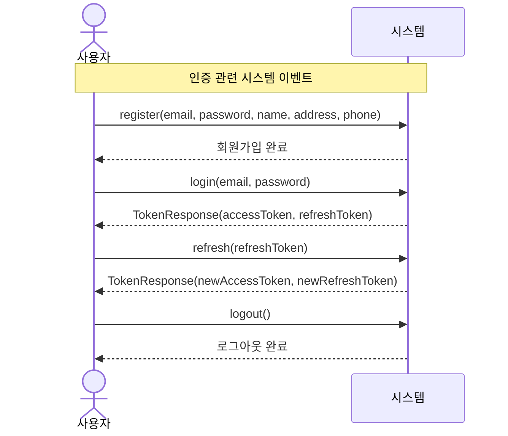

### After
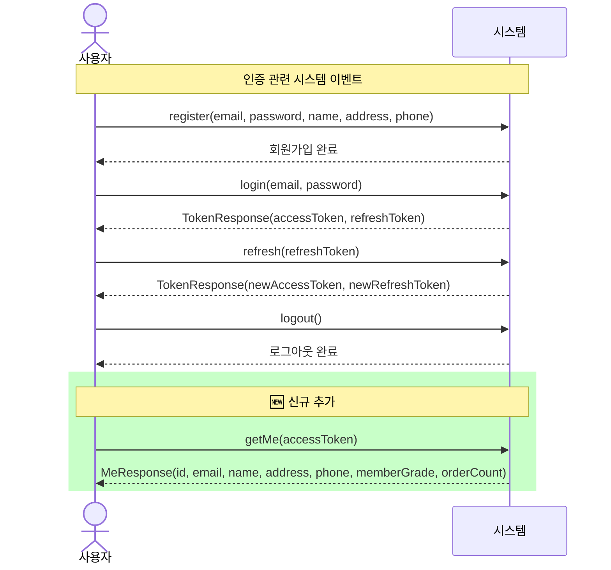

### 변경 요약
| 항목 | 변경 내용 |
|------|----------|
| 신규 이벤트 | `getMe(accessToken)` 추가 |
| 응답 | `MeResponse` 반환 (회원 등급 정보 포함) |

---

## 2. 시퀀스 다이어그램 (Sequence Diagram)

### Before (Auth 관련)
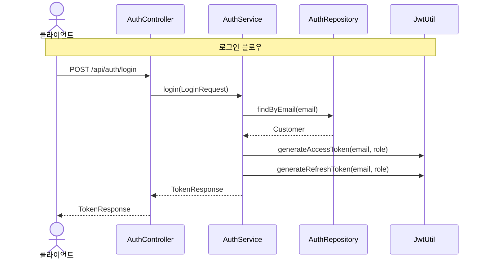

### After
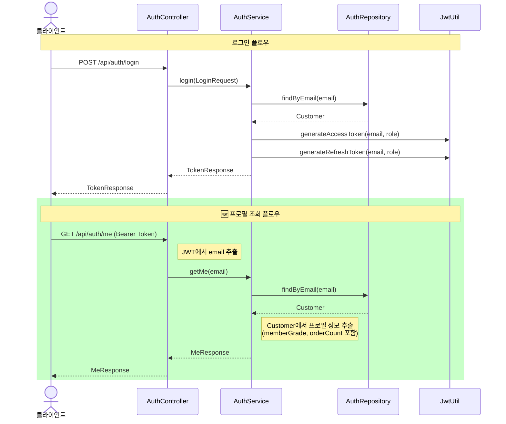

### 변경 요약
| 항목 | 변경 내용 |
|------|----------|
| 신규 플로우 | 프로필 조회 플로우 추가 |
| 참여 객체 | AuthController → AuthService → AuthRepository |
| 인증 방식 | JWT Bearer Token에서 email 추출 |

---

## 3. 클래스 다이어그램 (Class Diagram)

### AuthController 변경

#### Before
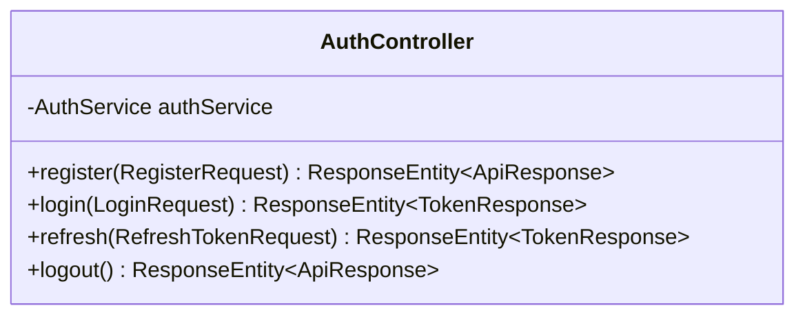

#### After
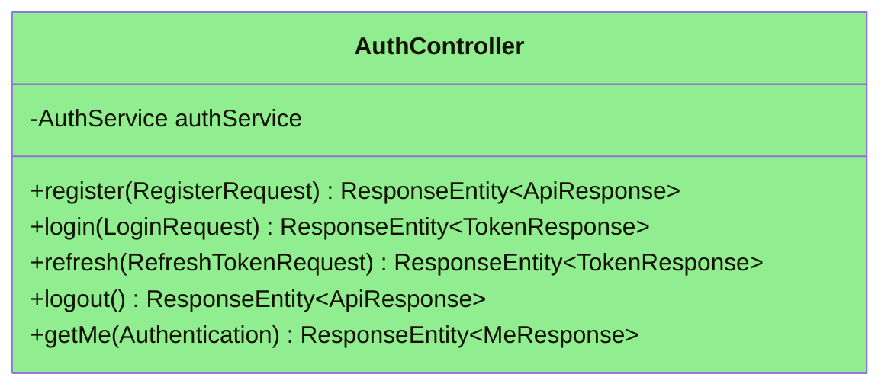

### AuthService 변경

#### Before
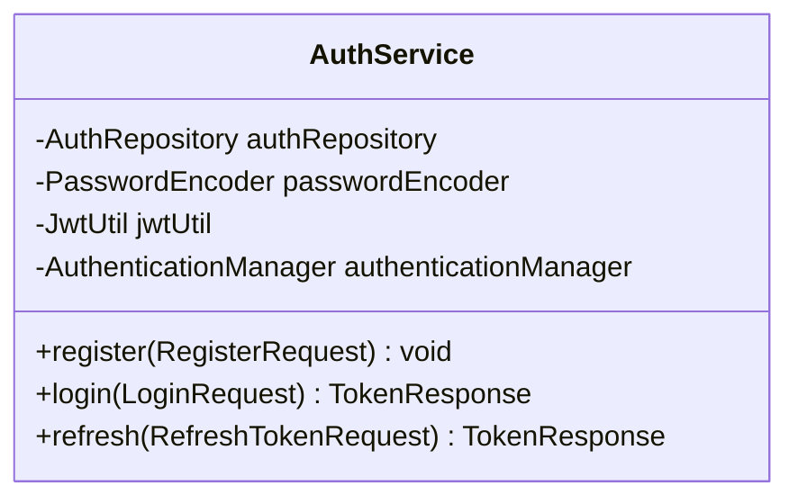

#### After
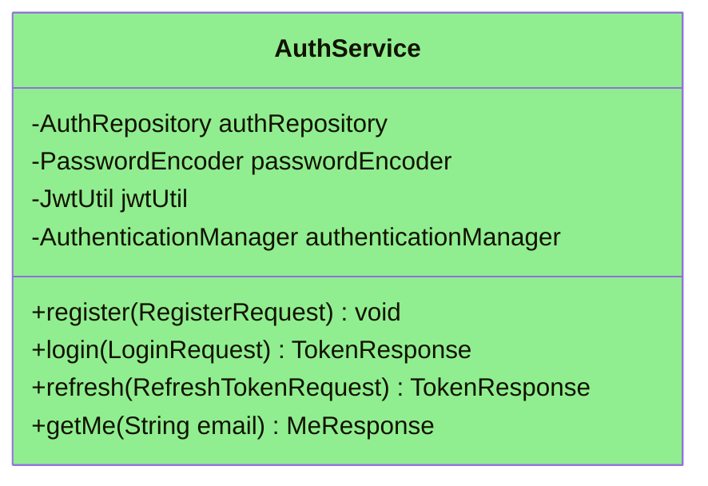

### 신규 DTO 추가

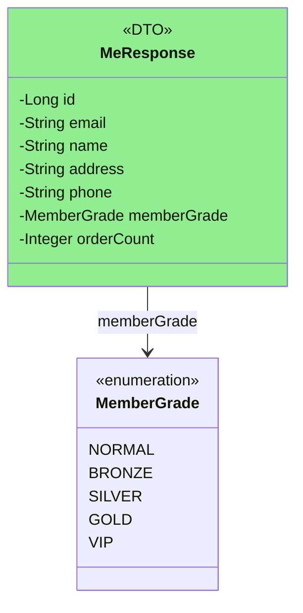

### 전체 Auth 클래스 다이어그램

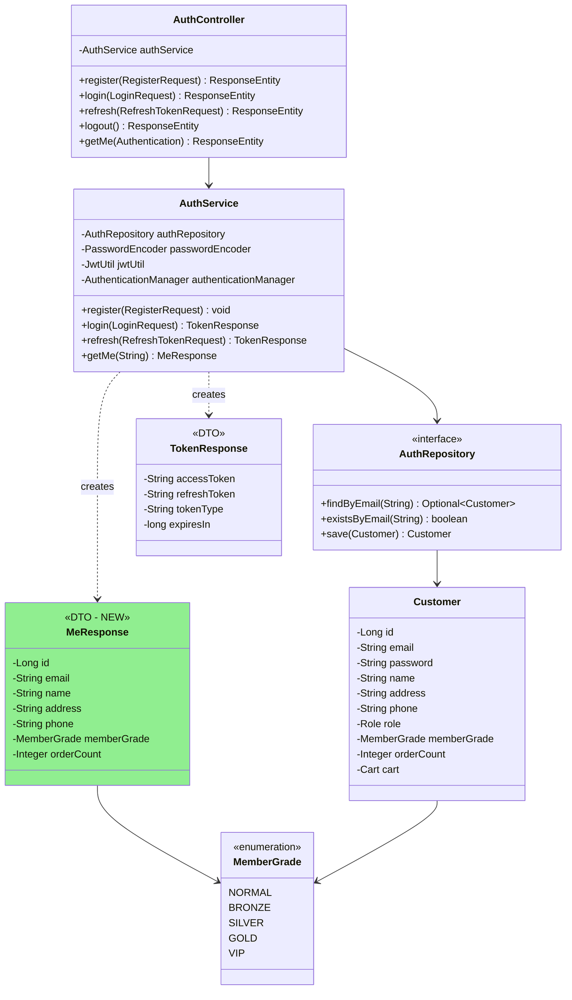

### 변경 요약
| 클래스 | 변경 내용 |
|--------|----------|
| AuthController | `+getMe(Authentication): ResponseEntity<MeResponse>` 메서드 추가 |
| AuthService | `+getMe(String email): MeResponse` 메서드 추가 |
| MeResponse | 🆕 신규 DTO 추가 (id, email, name, address, phone, memberGrade, orderCount) |

---

## 4. 패키지 다이어그램 (Package Diagram)

### Before
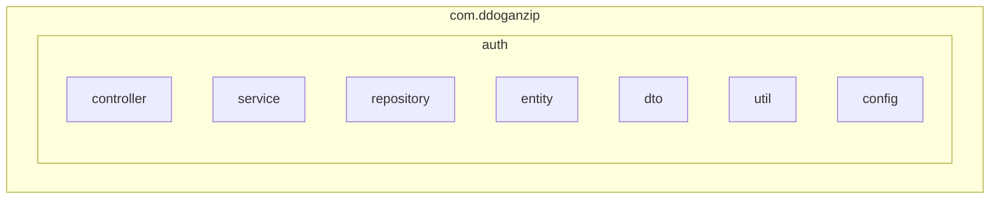

### After
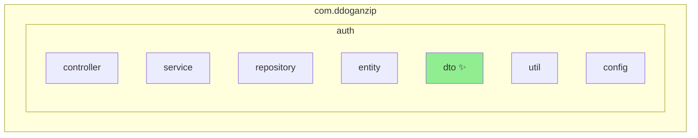

### auth.dto 패키지 상세

#### Before
```
com.ddoganzip.auth.dto
├── LoginRequest.java
├── RegisterRequest.java
├── RefreshTokenRequest.java
└── TokenResponse.java
```

#### After
```
com.ddoganzip.auth.dto
├── LoginRequest.java
├── RegisterRequest.java
├── RefreshTokenRequest.java
├── TokenResponse.java
└── MeResponse.java        ← 🆕 신규 추가
```

### 변경 요약
| 패키지 | 변경 내용 |
|--------|----------|
| com.ddoganzip.auth.dto | `MeResponse.java` 추가 |

---

## 5. API 명세

### Request
| 항목 | 값 |
|------|-----|
| Method | GET |
| URL | /api/auth/me |
| Headers | Authorization: Bearer {accessToken} |
| Body | 없음 |

### Response
```json
{
  "id": 1,
  "email": "user@example.com",
  "name": "홍길동",
  "address": "서울시 강남구",
  "phone": "010-1234-5678",
  "memberGrade": "SILVER",
  "orderCount": 12
}
```

### Response 필드 설명
| 필드 | 타입 | 설명 |
|------|------|------|
| id | number | 사용자 ID |
| email | string | 이메일 |
| name | string | 이름 |
| address | string | 주소 |
| phone | string | 전화번호 |
| memberGrade | string | 회원 등급 (NORMAL, BRONZE, SILVER, GOLD, VIP) |
| orderCount | number | 누적 주문 횟수 |

---

## 6. 변경 파일 목록

| 파일 | 변경 유형 | 설명 |
|------|----------|------|
| `MeResponse.java` | 🆕 신규 | 프로필 응답 DTO |
| `AuthService.java` | 수정 | `getMe()` 메서드 추가 |
| `AuthController.java` | 수정 | `GET /api/auth/me` 엔드포인트 추가 |

---

## 7. 관련 기능과의 연계

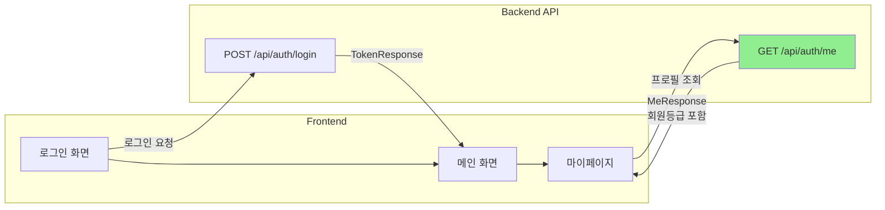

회원 등급 할인 기능과 연계하여, 프론트엔드에서 사용자의 현재 등급과 주문 횟수를 표시할 수 있습니다.
