# Class Diagrams

This document contains detailed Mermaid class diagrams for the DDogan Zip backend system.

---

## 1. Entity Class Diagram (Domain Model)

### 1.1 Core Entities & Relationships

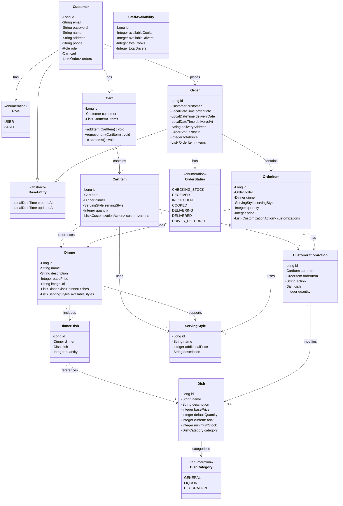

### 1.2 Entity Relationships (ER Style)

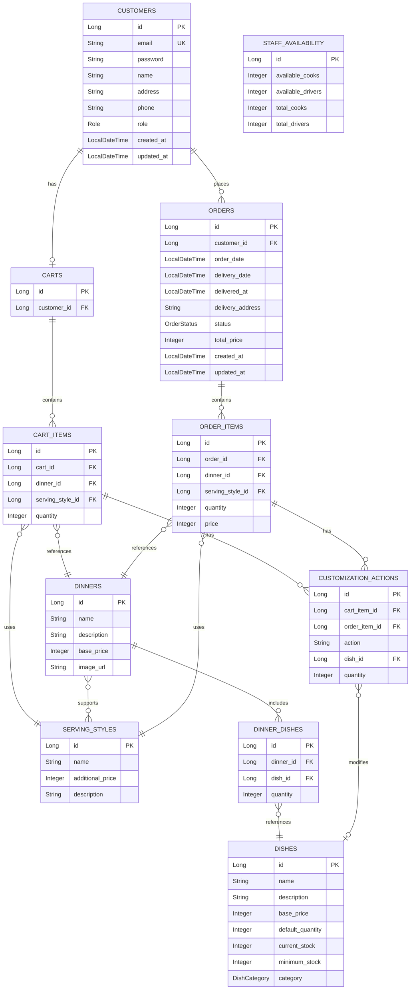

---

## 2. Service Layer Class Diagram

```mermaid
classDiagram
    direction TB

    %% Auth Services
    class AuthService {
        -AuthRepository authRepository
        -PasswordEncoder passwordEncoder
        -JwtUtil jwtUtil
        -AuthenticationManager authenticationManager
        +register(RegisterRequest) void
        +login(LoginRequest) TokenResponse
        +refresh(RefreshTokenRequest) TokenResponse
    }

    class CustomUserDetailsService {
        <<Service>>
        -AuthRepository authRepository
        +loadUserByUsername(String) UserDetails
    }

    %% Cart Service
    class CartService {
        -CartRepository cartRepository
        -CartItemRepository cartItemRepository
        -MenuRepository menuRepository
        -ServingStyleRepository servingStyleRepository
        -DishRepository dishRepository
        -AuthRepository authRepository
        -getCurrentCustomer() Customer
        +getCart() CartResponse
        +addItemToCart(AddToCartRequest) void
        +updateItemQuantity(Long, UpdateQuantityRequest) void
        +updateItemOptions(Long, UpdateOptionsRequest) void
        +removeItem(Long) void
        +customizeCartItem(Long, CustomizeCartItemRequest) void
        -mapToCartItemResponse(CartItem) CartItemResponse
    }

    %% Menu Service
    class MenuService {
        -MenuRepository menuRepository
        +getMenuList() List~MenuListResponse~
        +getMenuDetails(Long) MenuDetailResponse
    }

    %% Order Service
    class OrderService {
        -OrderRepository orderRepository
        -CartRepository cartRepository
        -AuthRepository authRepository
        -MenuRepository menuRepository
        -getCurrentCustomer() Customer
        +checkout(CheckoutRequest) Long
        +getOrderHistory() List~OrderHistoryResponse~
        +getOrderDetails(Long) OrderDetailResponse
    }

    %% Staff Service
    class StaffService {
        -OrderRepository orderRepository
        -DishRepository dishRepository
        -MenuRepository menuRepository
        -StaffAvailabilityRepository staffAvailabilityRepository
        +getActiveOrders() List~ActiveOrdersResponse~
        +getStaffAvailability() StaffAvailabilityResponse
        +updateOrderStatus(Long, UpdateOrderStatusRequest) void
        +driverReturn(Long) void
        -deductInventoryForOrder(Order) void
        +getInventory() List~InventoryItemResponse~
        +checkOrderInventory(Long) OrderInventoryCheckResponse
    }

    class InventoryScheduler {
        -DishRepository dishRepository
        +refillGeneralInventory() void
        +refillLiquorInventory() void
    }

    %% Utility Classes
    class JwtUtil {
        -String secret
        -long accessTokenValidity
        -long refreshTokenValidity
        -getSigningKey() Key
        +generateAccessToken(String, String) String
        +generateRefreshToken(String, String) String
        +validateToken(String) boolean
        +getEmailFromToken(String) String
        +getRoleFromToken(String) String
        +isTokenExpired(String) boolean
        +getAccessTokenValidity() long
    }

    %% Dependencies
    AuthService ..> JwtUtil : uses
    AuthService ..> AuthRepository : uses
    CustomUserDetailsService ..> AuthRepository : uses

    CartService ..> CartRepository : uses
    CartService ..> CartItemRepository : uses
    CartService ..> MenuRepository : uses
    CartService ..> DishRepository : uses
    CartService ..> AuthRepository : uses

    MenuService ..> MenuRepository : uses

    OrderService ..> OrderRepository : uses
    OrderService ..> CartRepository : uses
    OrderService ..> AuthRepository : uses
    OrderService ..> MenuRepository : uses

    StaffService ..> OrderRepository : uses
    StaffService ..> DishRepository : uses
    StaffService ..> MenuRepository : uses
    StaffService ..> StaffAvailabilityRepository : uses

    InventoryScheduler ..> DishRepository : uses
```

---

## 3. Controller Layer Class Diagram

```mermaid
classDiagram
    direction TB

    class AuthController {
        <<RestController>>
        -AuthService authService
        +register(RegisterRequest) ResponseEntity~ApiResponse~
        +login(LoginRequest) ResponseEntity~TokenResponse~
        +refresh(RefreshTokenRequest) ResponseEntity~TokenResponse~
        +logout() ResponseEntity~ApiResponse~
    }

    class CartController {
        <<RestController>>
        -CartService cartService
        +getCart() ResponseEntity~CartResponse~
        +addItemToCart(AddToCartRequest) ResponseEntity~CartResponse~
        +updateItemQuantity(Long, UpdateQuantityRequest) ResponseEntity~CartResponse~
        +updateItemOptions(Long, UpdateOptionsRequest) ResponseEntity~CartResponse~
        +removeItem(Long) ResponseEntity~CartResponse~
        +customizeCartItem(Long, CustomizeCartItemRequest) ResponseEntity~CartResponse~
    }

    class MenuController {
        <<RestController>>
        -MenuService menuService
        +getMenuList() ResponseEntity~List~
        +getMenuDetails(Long) ResponseEntity~MenuDetailResponse~
    }

    class OrderController {
        <<RestController>>
        -OrderService orderService
        +checkout(CheckoutRequest) ResponseEntity~ApiResponse~
        +getOrderHistory() ResponseEntity~List~
        +getOrderDetails(Long) ResponseEntity~OrderDetailResponse~
    }

    class StaffController {
        <<RestController>>
        -StaffService staffService
        +getActiveOrders() ResponseEntity~List~
        +updateOrderStatus(Long, UpdateOrderStatusRequest) ResponseEntity~ApiResponse~
        +getInventory() ResponseEntity~List~
        +checkOrderInventory(Long) ResponseEntity~OrderInventoryCheckResponse~
        +getStaffAvailability() ResponseEntity~StaffAvailabilityResponse~
        +driverReturn(Long) ResponseEntity~ApiResponse~
    }

    %% API Endpoints
    AuthController : POST /api/auth/register
    AuthController : POST /api/auth/login
    AuthController : POST /api/auth/refresh
    AuthController : POST /api/auth/logout

    CartController : GET /api/cart
    CartController : POST /api/cart/items
    CartController : PUT /api/cart/items/{id}/quantity
    CartController : PUT /api/cart/items/{id}/options
    CartController : DELETE /api/cart/items/{id}
    CartController : POST /api/cart/items/{id}/customize

    MenuController : GET /api/menu/list
    MenuController : GET /api/menu/details/{id}

    OrderController : POST /api/orders/checkout
    OrderController : GET /api/orders/history
    OrderController : GET /api/orders/{id}

    StaffController : GET /api/staff/orders/active
    StaffController : PUT /api/staff/orders/{id}/status
    StaffController : GET /api/staff/inventory
    StaffController : GET /api/staff/orders/{id}/inventory-check
    StaffController : GET /api/staff/availability
    StaffController : POST /api/staff/orders/{id}/driver-return

    %% Dependencies
    AuthController ..> AuthService : uses
    CartController ..> CartService : uses
    MenuController ..> MenuService : uses
    OrderController ..> OrderService : uses
    StaffController ..> StaffService : uses
```

---

## 4. DTO Class Diagram

### 4.1 Auth DTOs

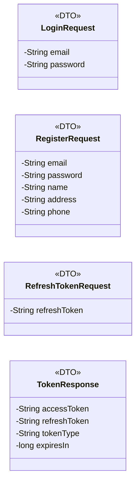

### 4.2 Cart DTOs

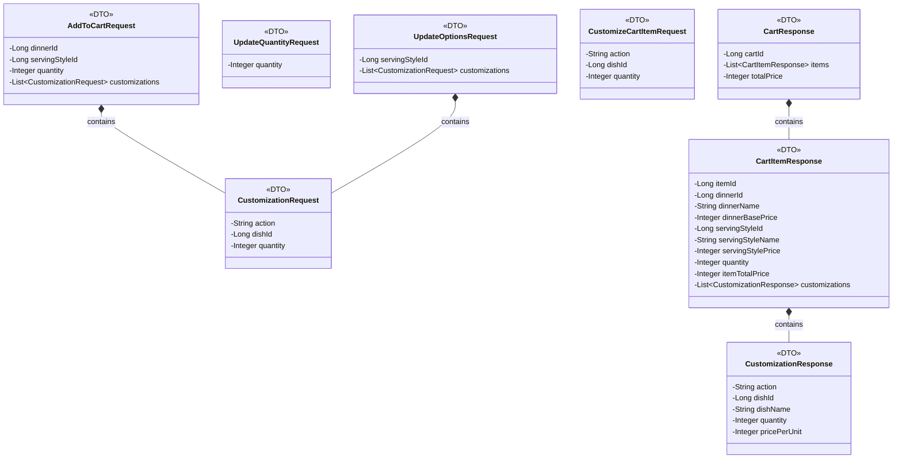

### 4.3 Menu DTOs

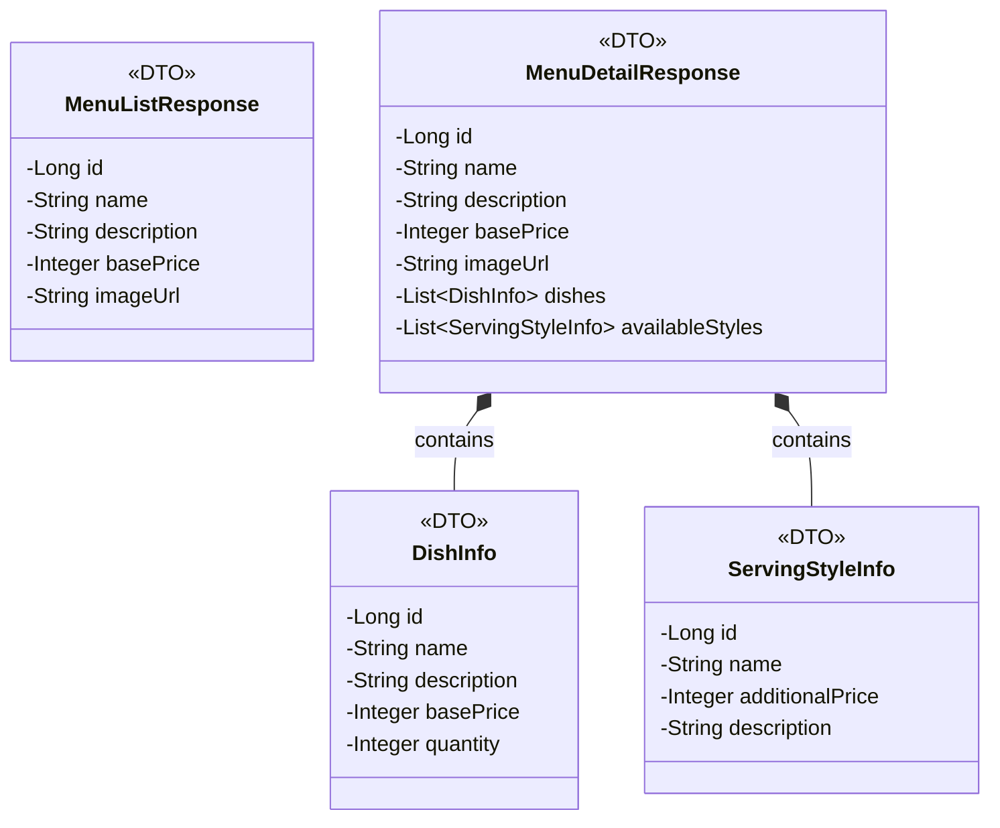

### 4.4 Order DTOs

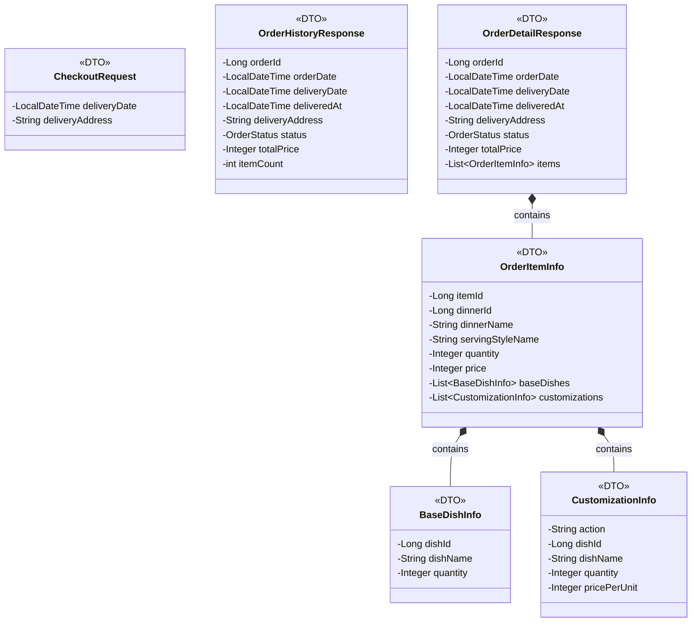

### 4.5 Staff DTOs

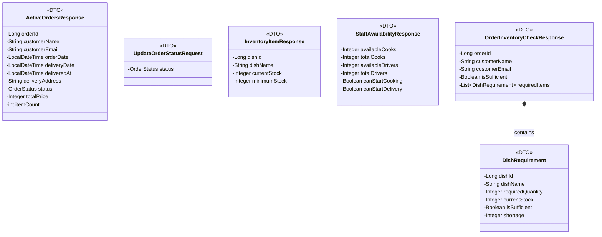

---

## 5. Repository Layer Class Diagram

```mermaid
classDiagram
    direction TB

    class JpaRepository~T, ID~ {
        <<interface>>
        +save(T) T
        +findById(ID) Optional~T~
        +findAll() List~T~
        +delete(T) void
        +existsById(ID) boolean
    }

    class AuthRepository {
        <<interface>>
        +findByEmail(String) Optional~Customer~
        +existsByEmail(String) boolean
    }

    class CartRepository {
        <<interface>>
        +findByCustomerId(Long) Optional~Cart~
        +findByCustomerIdWithItems(Long) Optional~Cart~
    }

    class CartItemRepository {
        <<interface>>
        +findByIdWithCustomizations(Long) Optional~CartItem~
    }

    class MenuRepository {
        <<interface>>
        +findByIdWithDishes(Long) Optional~Dinner~
        +findByIdWithStyles(Long) Optional~Dinner~
    }

    class DishRepository {
        <<interface>>
    }

    class ServingStyleRepository {
        <<interface>>
    }

    class OrderRepository {
        <<interface>>
        +findByCustomerIdOrderByOrderDateDesc(Long) List~Order~
        +findByIdWithDetails(Long) Optional~Order~
        +findActiveOrders(List~OrderStatus~) List~Order~
    }

    class OrderItemRepository {
        <<interface>>
    }

    class StaffAvailabilityRepository {
        <<interface>>
        +getStaffAvailability() StaffAvailability
    }

    AuthRepository --|> JpaRepository : extends
    CartRepository --|> JpaRepository : extends
    CartItemRepository --|> JpaRepository : extends
    MenuRepository --|> JpaRepository : extends
    DishRepository --|> JpaRepository : extends
    ServingStyleRepository --|> JpaRepository : extends
    OrderRepository --|> JpaRepository : extends
    OrderItemRepository --|> JpaRepository : extends
    StaffAvailabilityRepository --|> JpaRepository : extends
```

---

## 6. Configuration & Security Class Diagram

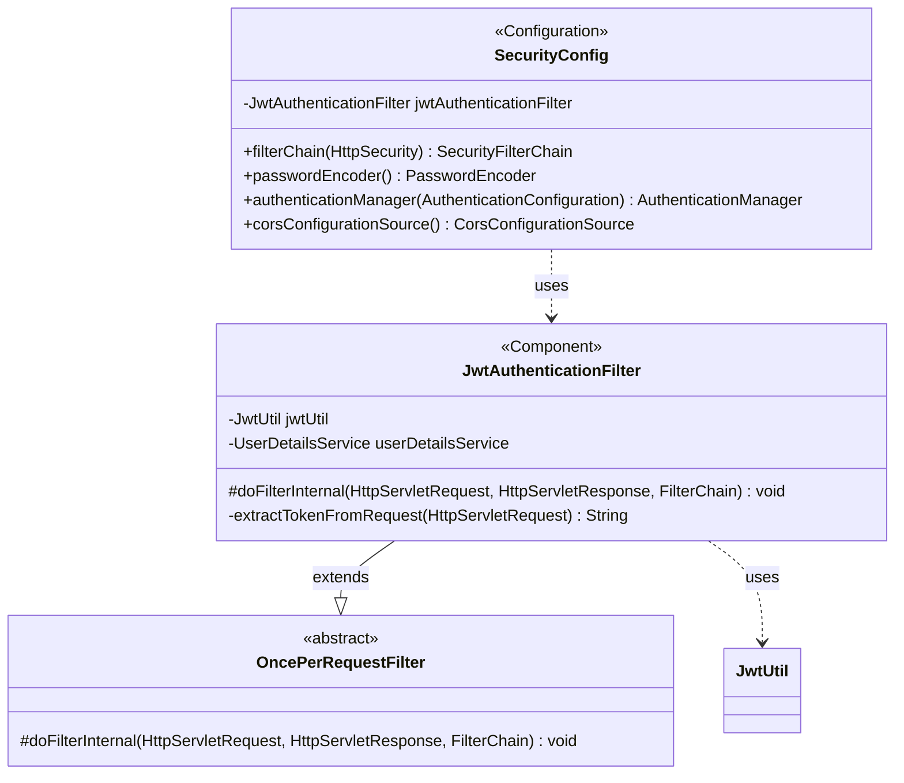

---

## 7. Exception Handling Class Diagram

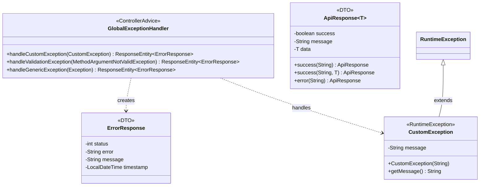

---

## 8. Complete System Overview

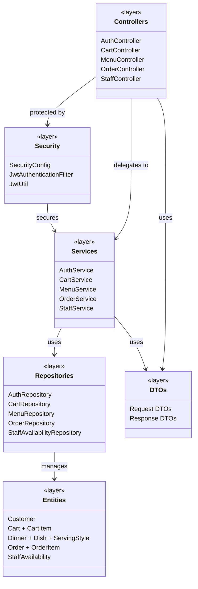
