# DDogan-zip 전체 클래스 다이어그램

> Mermaid Playground에서 렌더링하려면 [https://mermaid.live](https://mermaid.live) 에서 코드를 붙여넣으세요.

---

## 1. 전체 시스템 개요 다이어그램

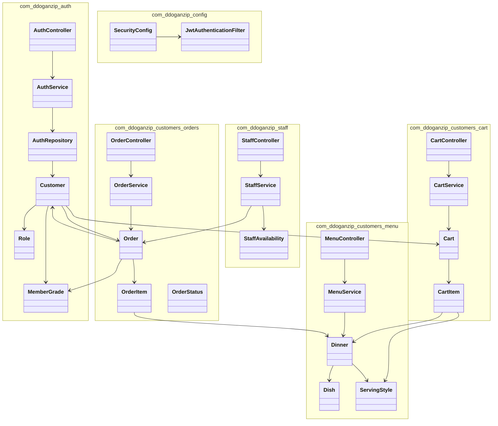
```mermaid
classDiagram
    namespace com_ddoganzip_auth {
        class AuthController
        class AuthService
        class AuthRepository
        class Customer
        class MemberGrade
        class Role
    }

    namespace com_ddoganzip_customers_cart {
        class CartController
        class CartService
        class Cart
        class CartItem
    }

    namespace com_ddoganzip_customers_menu {
        class MenuController
        class MenuService
        class Dinner
        class Dish
        class ServingStyle
    }

    namespace com_ddoganzip_customers_orders {
        class OrderController
        class OrderService
        class Order
        class OrderItem
        class OrderStatus
    }

    namespace com_ddoganzip_staff {
        class StaffController
        class StaffService
        class StaffAvailability
    }

    namespace com_ddoganzip_config {
        class SecurityConfig
        class JwtAuthenticationFilter
    }

    AuthController --> AuthService
    AuthService --> AuthRepository
    AuthRepository --> Customer
    Customer --> MemberGrade
    Customer --> Role
    Customer --> Cart
    Customer --> Order

    CartController --> CartService
    CartService --> Cart
    Cart --> CartItem
    CartItem --> Dinner
    CartItem --> ServingStyle

    MenuController --> MenuService
    MenuService --> Dinner
    Dinner --> Dish
    Dinner --> ServingStyle

    OrderController --> OrderService
    OrderService --> Order
    Order --> OrderItem
    Order --> Customer
    Order --> MemberGrade
    OrderItem --> Dinner

    StaffController --> StaffService
    StaffService --> Order
    StaffService --> StaffAvailability

    SecurityConfig --> JwtAuthenticationFilter
```

---

## 2. Auth 패키지 상세 다이어그램

### 2.1 auth.entity

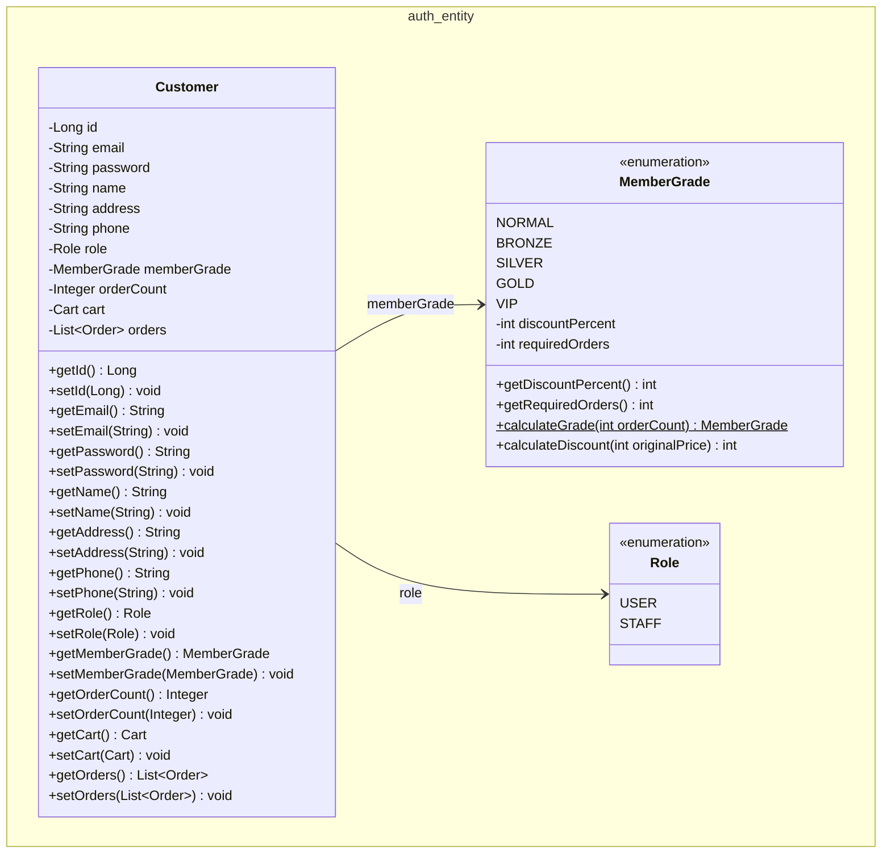
```mermaid
classDiagram
    namespace auth_entity {
        class Customer {
            -Long id
            -String email
            -String password
            -String name
            -String address
            -String phone
            -Role role
            -MemberGrade memberGrade
            -Integer orderCount
            -Cart cart
            -List~Order~ orders
            +getId() Long
            +setId(Long) void
            +getEmail() String
            +setEmail(String) void
            +getPassword() String
            +setPassword(String) void
            +getName() String
            +setName(String) void
            +getAddress() String
            +setAddress(String) void
            +getPhone() String
            +setPhone(String) void
            +getRole() Role
            +setRole(Role) void
            +getMemberGrade() MemberGrade
            +setMemberGrade(MemberGrade) void
            +getOrderCount() Integer
            +setOrderCount(Integer) void
            +getCart() Cart
            +setCart(Cart) void
            +getOrders() List~Order~
            +setOrders(List~Order~) void
        }

        class MemberGrade {
            <<enumeration>>
            NORMAL
            BRONZE
            SILVER
            GOLD
            VIP
            -int discountPercent
            -int requiredOrders
            +getDiscountPercent() int
            +getRequiredOrders() int
            +calculateGrade(int orderCount)$ MemberGrade
            +calculateDiscount(int originalPrice) int
        }

        class Role {
            <<enumeration>>
            USER
            STAFF
        }
    }

    Customer --> MemberGrade : memberGrade
    Customer --> Role : role
```

### 2.2 auth.dto

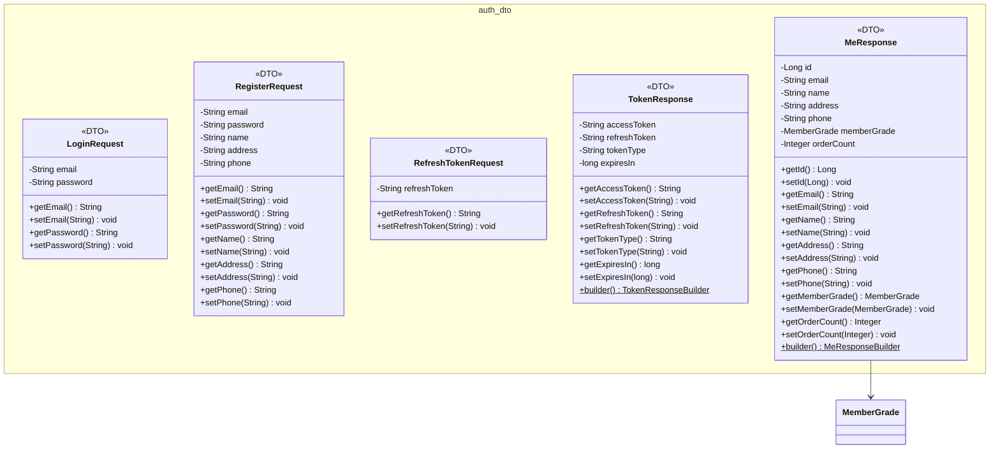
```mermaid
classDiagram
    namespace auth_dto {
        class LoginRequest {
            <<DTO>>
            -String email
            -String password
            +getEmail() String
            +setEmail(String) void
            +getPassword() String
            +setPassword(String) void
        }

        class RegisterRequest {
            <<DTO>>
            -String email
            -String password
            -String name
            -String address
            -String phone
            +getEmail() String
            +setEmail(String) void
            +getPassword() String
            +setPassword(String) void
            +getName() String
            +setName(String) void
            +getAddress() String
            +setAddress(String) void
            +getPhone() String
            +setPhone(String) void
        }

        class RefreshTokenRequest {
            <<DTO>>
            -String refreshToken
            +getRefreshToken() String
            +setRefreshToken(String) void
        }

        class TokenResponse {
            <<DTO>>
            -String accessToken
            -String refreshToken
            -String tokenType
            -long expiresIn
            +getAccessToken() String
            +setAccessToken(String) void
            +getRefreshToken() String
            +setRefreshToken(String) void
            +getTokenType() String
            +setTokenType(String) void
            +getExpiresIn() long
            +setExpiresIn(long) void
            +builder()$ TokenResponseBuilder
        }

        class MeResponse {
            <<DTO>>
            -Long id
            -String email
            -String name
            -String address
            -String phone
            -MemberGrade memberGrade
            -Integer orderCount
            +getId() Long
            +setId(Long) void
            +getEmail() String
            +setEmail(String) void
            +getName() String
            +setName(String) void
            +getAddress() String
            +setAddress(String) void
            +getPhone() String
            +setPhone(String) void
            +getMemberGrade() MemberGrade
            +setMemberGrade(MemberGrade) void
            +getOrderCount() Integer
            +setOrderCount(Integer) void
            +builder()$ MeResponseBuilder
        }
    }

    MeResponse --> MemberGrade
```

### 2.3 auth.controller, service, repository, util

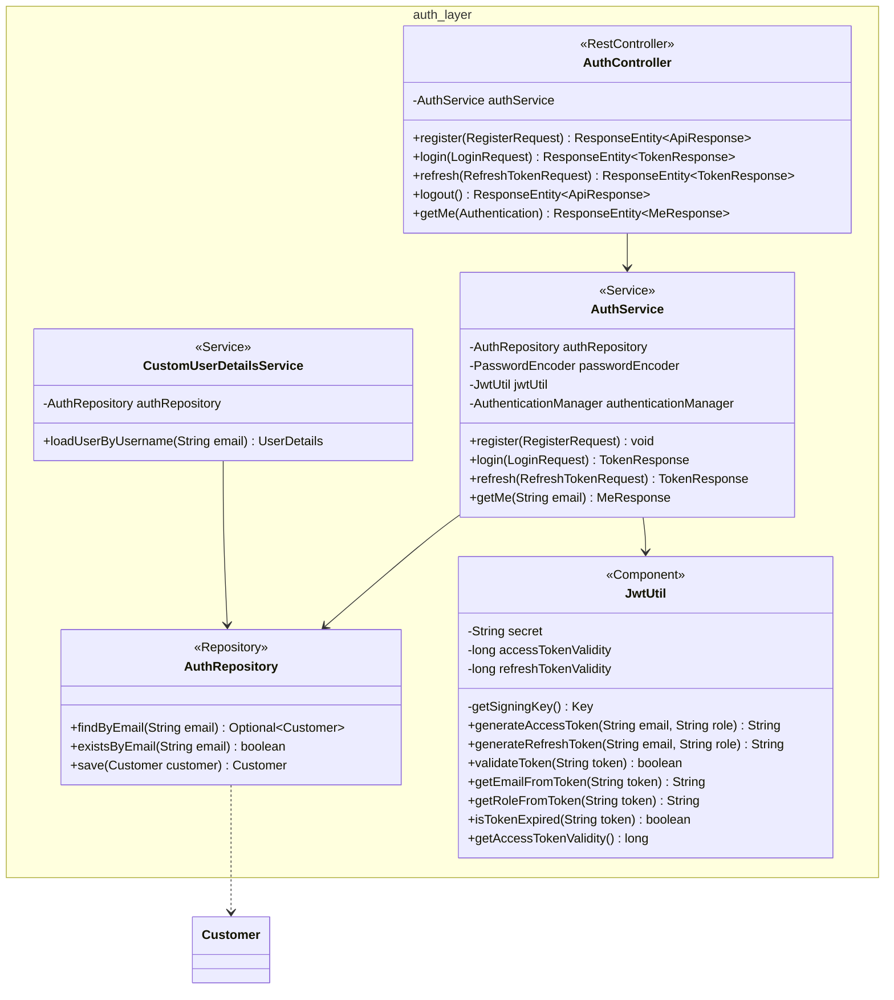
```mermaid
classDiagram
    namespace auth_layer {
        class AuthController {
            <<RestController>>
            -AuthService authService
            +register(RegisterRequest) ResponseEntity~ApiResponse~
            +login(LoginRequest) ResponseEntity~TokenResponse~
            +refresh(RefreshTokenRequest) ResponseEntity~TokenResponse~
            +logout() ResponseEntity~ApiResponse~
            +getMe(Authentication) ResponseEntity~MeResponse~
        }

        class AuthService {
            <<Service>>
            -AuthRepository authRepository
            -PasswordEncoder passwordEncoder
            -JwtUtil jwtUtil
            -AuthenticationManager authenticationManager
            +register(RegisterRequest) void
            +login(LoginRequest) TokenResponse
            +refresh(RefreshTokenRequest) TokenResponse
            +getMe(String email) MeResponse
        }

        class CustomUserDetailsService {
            <<Service>>
            -AuthRepository authRepository
            +loadUserByUsername(String email) UserDetails
        }

        class AuthRepository {
            <<Repository>>
            <<interface>>
            +findByEmail(String email) Optional~Customer~
            +existsByEmail(String email) boolean
            +save(Customer customer) Customer
        }

        class JwtUtil {
            <<Component>>
            -String secret
            -long accessTokenValidity
            -long refreshTokenValidity
            -getSigningKey() Key
            +generateAccessToken(String email, String role) String
            +generateRefreshToken(String email, String role) String
            +validateToken(String token) boolean
            +getEmailFromToken(String token) String
            +getRoleFromToken(String token) String
            +isTokenExpired(String token) boolean
            +getAccessTokenValidity() long
        }
    }

    AuthController --> AuthService
    AuthService --> AuthRepository
    AuthService --> JwtUtil
    CustomUserDetailsService --> AuthRepository
    AuthRepository ..> Customer
```

---

## 3. Cart 패키지 상세 다이어그램

### 3.1 cart.entity

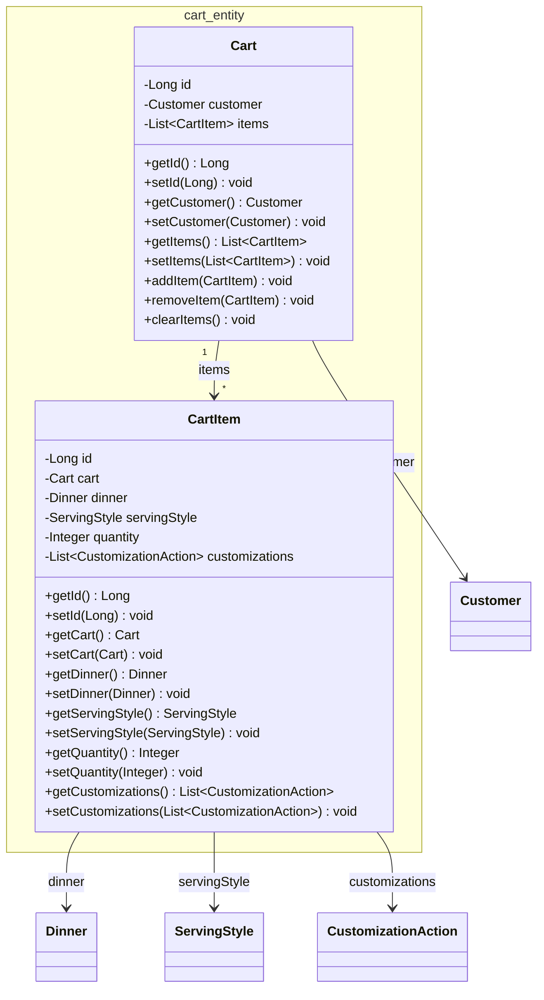
```mermaid
classDiagram
    namespace cart_entity {
        class Cart {
            -Long id
            -Customer customer
            -List~CartItem~ items
            +getId() Long
            +setId(Long) void
            +getCustomer() Customer
            +setCustomer(Customer) void
            +getItems() List~CartItem~
            +setItems(List~CartItem~) void
            +addItem(CartItem) void
            +removeItem(CartItem) void
            +clearItems() void
        }

        class CartItem {
            -Long id
            -Cart cart
            -Dinner dinner
            -ServingStyle servingStyle
            -Integer quantity
            -List~CustomizationAction~ customizations
            +getId() Long
            +setId(Long) void
            +getCart() Cart
            +setCart(Cart) void
            +getDinner() Dinner
            +setDinner(Dinner) void
            +getServingStyle() ServingStyle
            +setServingStyle(ServingStyle) void
            +getQuantity() Integer
            +setQuantity(Integer) void
            +getCustomizations() List~CustomizationAction~
            +setCustomizations(List~CustomizationAction~) void
        }
    }

    Cart "1" --> "*" CartItem : items
    Cart --> Customer : customer
    CartItem --> Dinner : dinner
    CartItem --> ServingStyle : servingStyle
    CartItem --> CustomizationAction : customizations
```

### 3.2 cart.dto

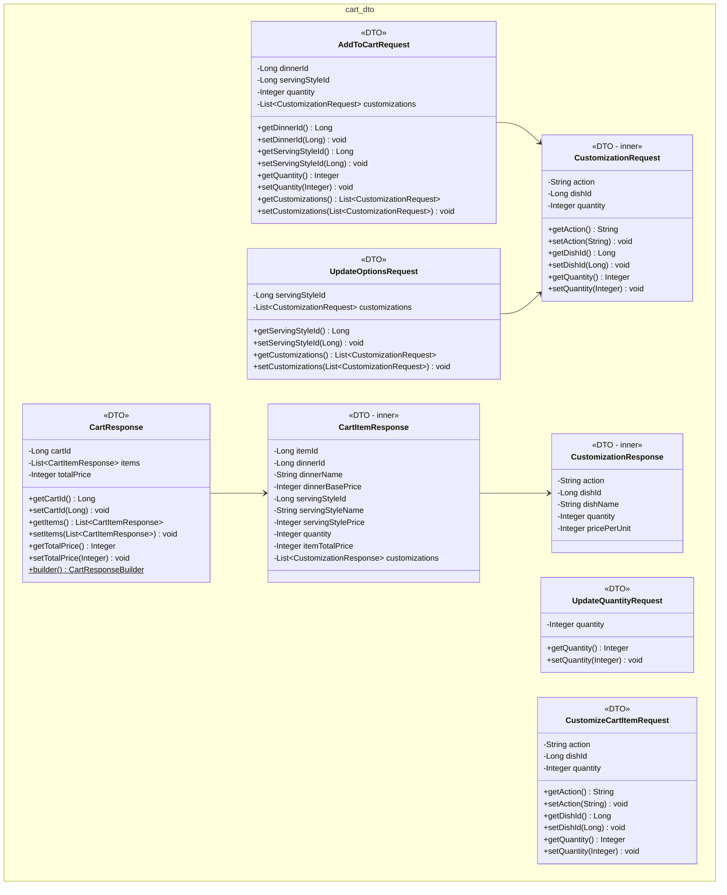
```mermaid
classDiagram
    namespace cart_dto {
        class AddToCartRequest {
            <<DTO>>
            -Long dinnerId
            -Long servingStyleId
            -Integer quantity
            -List~CustomizationRequest~ customizations
            +getDinnerId() Long
            +setDinnerId(Long) void
            +getServingStyleId() Long
            +setServingStyleId(Long) void
            +getQuantity() Integer
            +setQuantity(Integer) void
            +getCustomizations() List~CustomizationRequest~
            +setCustomizations(List~CustomizationRequest~) void
        }

        class CustomizationRequest {
            <<DTO - inner>>
            -String action
            -Long dishId
            -Integer quantity
            +getAction() String
            +setAction(String) void
            +getDishId() Long
            +setDishId(Long) void
            +getQuantity() Integer
            +setQuantity(Integer) void
        }

        class CartResponse {
            <<DTO>>
            -Long cartId
            -List~CartItemResponse~ items
            -Integer totalPrice
            +getCartId() Long
            +setCartId(Long) void
            +getItems() List~CartItemResponse~
            +setItems(List~CartItemResponse~) void
            +getTotalPrice() Integer
            +setTotalPrice(Integer) void
            +builder()$ CartResponseBuilder
        }

        class CartItemResponse {
            <<DTO - inner>>
            -Long itemId
            -Long dinnerId
            -String dinnerName
            -Integer dinnerBasePrice
            -Long servingStyleId
            -String servingStyleName
            -Integer servingStylePrice
            -Integer quantity
            -Integer itemTotalPrice
            -List~CustomizationResponse~ customizations
        }

        class CustomizationResponse {
            <<DTO - inner>>
            -String action
            -Long dishId
            -String dishName
            -Integer quantity
            -Integer pricePerUnit
        }

        class UpdateQuantityRequest {
            <<DTO>>
            -Integer quantity
            +getQuantity() Integer
            +setQuantity(Integer) void
        }

        class UpdateOptionsRequest {
            <<DTO>>
            -Long servingStyleId
            -List~CustomizationRequest~ customizations
            +getServingStyleId() Long
            +setServingStyleId(Long) void
            +getCustomizations() List~CustomizationRequest~
            +setCustomizations(List~CustomizationRequest~) void
        }

        class CustomizeCartItemRequest {
            <<DTO>>
            -String action
            -Long dishId
            -Integer quantity
            +getAction() String
            +setAction(String) void
            +getDishId() Long
            +setDishId(Long) void
            +getQuantity() Integer
            +setQuantity(Integer) void
        }
    }

    AddToCartRequest --> CustomizationRequest
    CartResponse --> CartItemResponse
    CartItemResponse --> CustomizationResponse
    UpdateOptionsRequest --> CustomizationRequest
```

### 3.3 cart.controller, service, repository

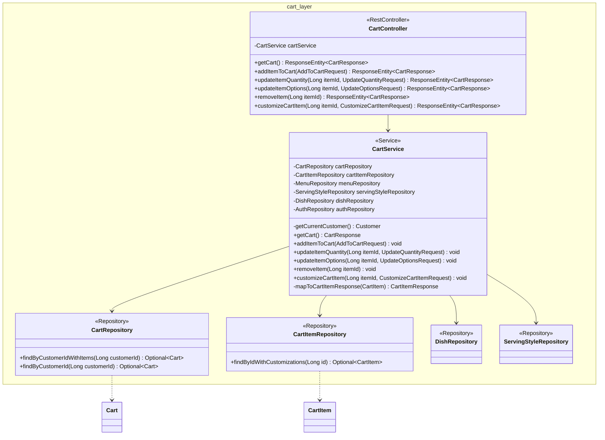
```mermaid
classDiagram
    namespace cart_layer {
        class CartController {
            <<RestController>>
            -CartService cartService
            +getCart() ResponseEntity~CartResponse~
            +addItemToCart(AddToCartRequest) ResponseEntity~CartResponse~
            +updateItemQuantity(Long itemId, UpdateQuantityRequest) ResponseEntity~CartResponse~
            +updateItemOptions(Long itemId, UpdateOptionsRequest) ResponseEntity~CartResponse~
            +removeItem(Long itemId) ResponseEntity~CartResponse~
            +customizeCartItem(Long itemId, CustomizeCartItemRequest) ResponseEntity~CartResponse~
        }

        class CartService {
            <<Service>>
            -CartRepository cartRepository
            -CartItemRepository cartItemRepository
            -MenuRepository menuRepository
            -ServingStyleRepository servingStyleRepository
            -DishRepository dishRepository
            -AuthRepository authRepository
            -getCurrentCustomer() Customer
            +getCart() CartResponse
            +addItemToCart(AddToCartRequest) void
            +updateItemQuantity(Long itemId, UpdateQuantityRequest) void
            +updateItemOptions(Long itemId, UpdateOptionsRequest) void
            +removeItem(Long itemId) void
            +customizeCartItem(Long itemId, CustomizeCartItemRequest) void
            -mapToCartItemResponse(CartItem) CartItemResponse
        }

        class CartRepository {
            <<Repository>>
            <<interface>>
            +findByCustomerIdWithItems(Long customerId) Optional~Cart~
            +findByCustomerId(Long customerId) Optional~Cart~
        }

        class CartItemRepository {
            <<Repository>>
            <<interface>>
            +findByIdWithCustomizations(Long id) Optional~CartItem~
        }

        class DishRepository {
            <<Repository>>
            <<interface>>
        }

        class ServingStyleRepository {
            <<Repository>>
            <<interface>>
        }
    }

    CartController --> CartService
    CartService --> CartRepository
    CartService --> CartItemRepository
    CartService --> DishRepository
    CartService --> ServingStyleRepository
    CartRepository ..> Cart
    CartItemRepository ..> CartItem
```

---

## 4. Menu 패키지 상세 다이어그램

### 4.1 menu.entity

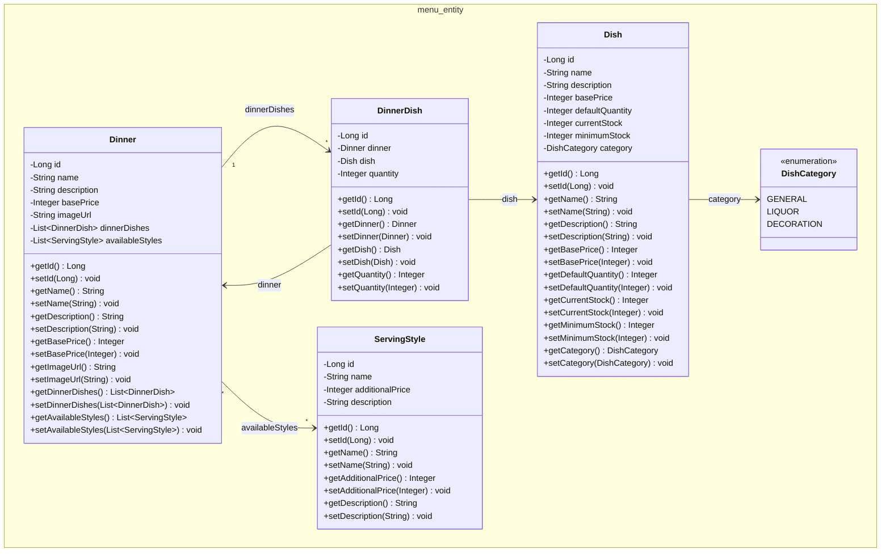
```mermaid
classDiagram
    namespace menu_entity {
        class Dinner {
            -Long id
            -String name
            -String description
            -Integer basePrice
            -String imageUrl
            -List~DinnerDish~ dinnerDishes
            -List~ServingStyle~ availableStyles
            +getId() Long
            +setId(Long) void
            +getName() String
            +setName(String) void
            +getDescription() String
            +setDescription(String) void
            +getBasePrice() Integer
            +setBasePrice(Integer) void
            +getImageUrl() String
            +setImageUrl(String) void
            +getDinnerDishes() List~DinnerDish~
            +setDinnerDishes(List~DinnerDish~) void
            +getAvailableStyles() List~ServingStyle~
            +setAvailableStyles(List~ServingStyle~) void
        }

        class DinnerDish {
            -Long id
            -Dinner dinner
            -Dish dish
            -Integer quantity
            +getId() Long
            +setId(Long) void
            +getDinner() Dinner
            +setDinner(Dinner) void
            +getDish() Dish
            +setDish(Dish) void
            +getQuantity() Integer
            +setQuantity(Integer) void
        }

        class Dish {
            -Long id
            -String name
            -String description
            -Integer basePrice
            -Integer defaultQuantity
            -Integer currentStock
            -Integer minimumStock
            -DishCategory category
            +getId() Long
            +setId(Long) void
            +getName() String
            +setName(String) void
            +getDescription() String
            +setDescription(String) void
            +getBasePrice() Integer
            +setBasePrice(Integer) void
            +getDefaultQuantity() Integer
            +setDefaultQuantity(Integer) void
            +getCurrentStock() Integer
            +setCurrentStock(Integer) void
            +getMinimumStock() Integer
            +setMinimumStock(Integer) void
            +getCategory() DishCategory
            +setCategory(DishCategory) void
        }

        class ServingStyle {
            -Long id
            -String name
            -Integer additionalPrice
            -String description
            +getId() Long
            +setId(Long) void
            +getName() String
            +setName(String) void
            +getAdditionalPrice() Integer
            +setAdditionalPrice(Integer) void
            +getDescription() String
            +setDescription(String) void
        }

        class DishCategory {
            <<enumeration>>
            GENERAL
            LIQUOR
            DECORATION
        }
    }

    Dinner "1" --> "*" DinnerDish : dinnerDishes
    Dinner "*" --> "*" ServingStyle : availableStyles
    DinnerDish --> Dinner : dinner
    DinnerDish --> Dish : dish
    Dish --> DishCategory : category
```

### 4.2 menu.dto

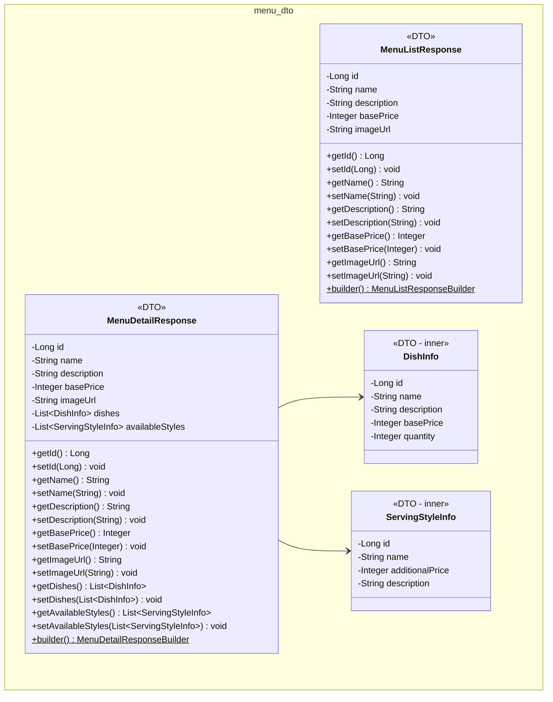
```mermaid
classDiagram
    namespace menu_dto {
        class MenuListResponse {
            <<DTO>>
            -Long id
            -String name
            -String description
            -Integer basePrice
            -String imageUrl
            +getId() Long
            +setId(Long) void
            +getName() String
            +setName(String) void
            +getDescription() String
            +setDescription(String) void
            +getBasePrice() Integer
            +setBasePrice(Integer) void
            +getImageUrl() String
            +setImageUrl(String) void
            +builder()$ MenuListResponseBuilder
        }

        class MenuDetailResponse {
            <<DTO>>
            -Long id
            -String name
            -String description
            -Integer basePrice
            -String imageUrl
            -List~DishInfo~ dishes
            -List~ServingStyleInfo~ availableStyles
            +getId() Long
            +setId(Long) void
            +getName() String
            +setName(String) void
            +getDescription() String
            +setDescription(String) void
            +getBasePrice() Integer
            +setBasePrice(Integer) void
            +getImageUrl() String
            +setImageUrl(String) void
            +getDishes() List~DishInfo~
            +setDishes(List~DishInfo~) void
            +getAvailableStyles() List~ServingStyleInfo~
            +setAvailableStyles(List~ServingStyleInfo~) void
            +builder()$ MenuDetailResponseBuilder
        }

        class DishInfo {
            <<DTO - inner>>
            -Long id
            -String name
            -String description
            -Integer basePrice
            -Integer quantity
        }

        class ServingStyleInfo {
            <<DTO - inner>>
            -Long id
            -String name
            -Integer additionalPrice
            -String description
        }
    }

    MenuDetailResponse --> DishInfo
    MenuDetailResponse --> ServingStyleInfo
```

### 4.3 menu.controller, service, repository

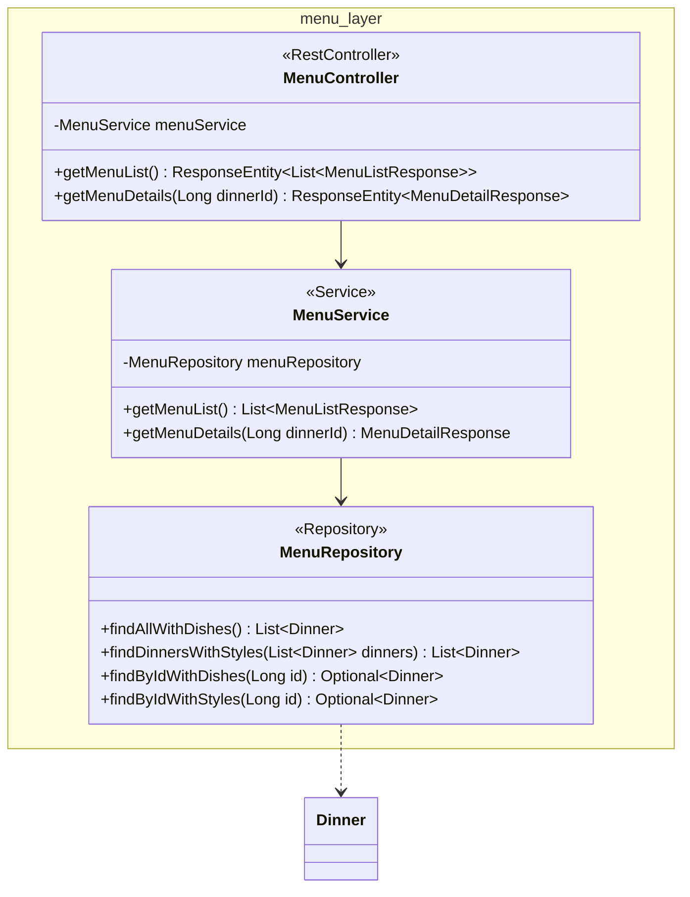
```mermaid
classDiagram
    namespace menu_layer {
        class MenuController {
            <<RestController>>
            -MenuService menuService
            +getMenuList() ResponseEntity~List~MenuListResponse~~
            +getMenuDetails(Long dinnerId) ResponseEntity~MenuDetailResponse~
        }

        class MenuService {
            <<Service>>
            -MenuRepository menuRepository
            +getMenuList() List~MenuListResponse~
            +getMenuDetails(Long dinnerId) MenuDetailResponse
        }

        class MenuRepository {
            <<Repository>>
            <<interface>>
            +findAllWithDishes() List~Dinner~
            +findDinnersWithStyles(List~Dinner~ dinners) List~Dinner~
            +findByIdWithDishes(Long id) Optional~Dinner~
            +findByIdWithStyles(Long id) Optional~Dinner~
        }
    }

    MenuController --> MenuService
    MenuService --> MenuRepository
    MenuRepository ..> Dinner
```

---

## 5. Orders 패키지 상세 다이어그램

### 5.1 orders.entity

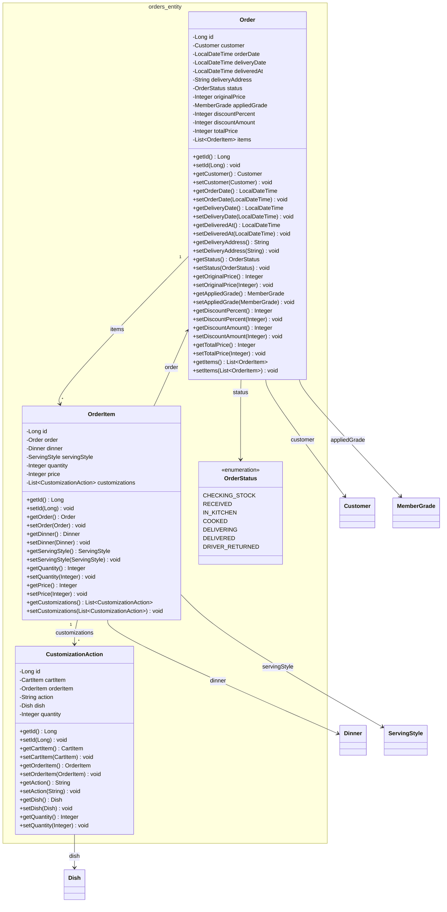
```mermaid
classDiagram
    namespace orders_entity {
        class Order {
            -Long id
            -Customer customer
            -LocalDateTime orderDate
            -LocalDateTime deliveryDate
            -LocalDateTime deliveredAt
            -String deliveryAddress
            -OrderStatus status
            -Integer originalPrice
            -MemberGrade appliedGrade
            -Integer discountPercent
            -Integer discountAmount
            -Integer totalPrice
            -List~OrderItem~ items
            +getId() Long
            +setId(Long) void
            +getCustomer() Customer
            +setCustomer(Customer) void
            +getOrderDate() LocalDateTime
            +setOrderDate(LocalDateTime) void
            +getDeliveryDate() LocalDateTime
            +setDeliveryDate(LocalDateTime) void
            +getDeliveredAt() LocalDateTime
            +setDeliveredAt(LocalDateTime) void
            +getDeliveryAddress() String
            +setDeliveryAddress(String) void
            +getStatus() OrderStatus
            +setStatus(OrderStatus) void
            +getOriginalPrice() Integer
            +setOriginalPrice(Integer) void
            +getAppliedGrade() MemberGrade
            +setAppliedGrade(MemberGrade) void
            +getDiscountPercent() Integer
            +setDiscountPercent(Integer) void
            +getDiscountAmount() Integer
            +setDiscountAmount(Integer) void
            +getTotalPrice() Integer
            +setTotalPrice(Integer) void
            +getItems() List~OrderItem~
            +setItems(List~OrderItem~) void
        }

        class OrderItem {
            -Long id
            -Order order
            -Dinner dinner
            -ServingStyle servingStyle
            -Integer quantity
            -Integer price
            -List~CustomizationAction~ customizations
            +getId() Long
            +setId(Long) void
            +getOrder() Order
            +setOrder(Order) void
            +getDinner() Dinner
            +setDinner(Dinner) void
            +getServingStyle() ServingStyle
            +setServingStyle(ServingStyle) void
            +getQuantity() Integer
            +setQuantity(Integer) void
            +getPrice() Integer
            +setPrice(Integer) void
            +getCustomizations() List~CustomizationAction~
            +setCustomizations(List~CustomizationAction~) void
        }

        class CustomizationAction {
            -Long id
            -CartItem cartItem
            -OrderItem orderItem
            -String action
            -Dish dish
            -Integer quantity
            +getId() Long
            +setId(Long) void
            +getCartItem() CartItem
            +setCartItem(CartItem) void
            +getOrderItem() OrderItem
            +setOrderItem(OrderItem) void
            +getAction() String
            +setAction(String) void
            +getDish() Dish
            +setDish(Dish) void
            +getQuantity() Integer
            +setQuantity(Integer) void
        }

        class OrderStatus {
            <<enumeration>>
            CHECKING_STOCK
            RECEIVED
            IN_KITCHEN
            COOKED
            DELIVERING
            DELIVERED
            DRIVER_RETURNED
        }
    }

    Order "1" --> "*" OrderItem : items
    Order --> Customer : customer
    Order --> OrderStatus : status
    Order --> MemberGrade : appliedGrade
    OrderItem --> Order : order
    OrderItem --> Dinner : dinner
    OrderItem --> ServingStyle : servingStyle
    OrderItem "1" --> "*" CustomizationAction : customizations
    CustomizationAction --> Dish : dish
```

### 5.2 orders.dto

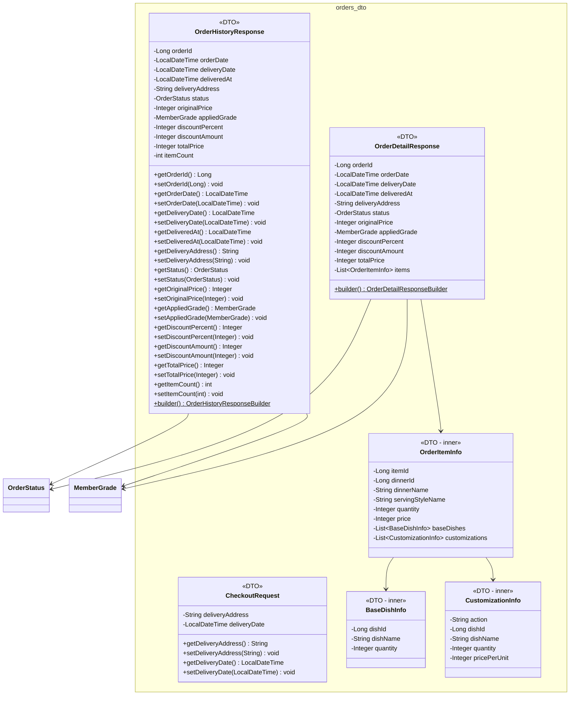
```mermaid
classDiagram
    namespace orders_dto {
        class CheckoutRequest {
            <<DTO>>
            -String deliveryAddress
            -LocalDateTime deliveryDate
            +getDeliveryAddress() String
            +setDeliveryAddress(String) void
            +getDeliveryDate() LocalDateTime
            +setDeliveryDate(LocalDateTime) void
        }

        class OrderHistoryResponse {
            <<DTO>>
            -Long orderId
            -LocalDateTime orderDate
            -LocalDateTime deliveryDate
            -LocalDateTime deliveredAt
            -String deliveryAddress
            -OrderStatus status
            -Integer originalPrice
            -MemberGrade appliedGrade
            -Integer discountPercent
            -Integer discountAmount
            -Integer totalPrice
            -int itemCount
            +getOrderId() Long
            +setOrderId(Long) void
            +getOrderDate() LocalDateTime
            +setOrderDate(LocalDateTime) void
            +getDeliveryDate() LocalDateTime
            +setDeliveryDate(LocalDateTime) void
            +getDeliveredAt() LocalDateTime
            +setDeliveredAt(LocalDateTime) void
            +getDeliveryAddress() String
            +setDeliveryAddress(String) void
            +getStatus() OrderStatus
            +setStatus(OrderStatus) void
            +getOriginalPrice() Integer
            +setOriginalPrice(Integer) void
            +getAppliedGrade() MemberGrade
            +setAppliedGrade(MemberGrade) void
            +getDiscountPercent() Integer
            +setDiscountPercent(Integer) void
            +getDiscountAmount() Integer
            +setDiscountAmount(Integer) void
            +getTotalPrice() Integer
            +setTotalPrice(Integer) void
            +getItemCount() int
            +setItemCount(int) void
            +builder()$ OrderHistoryResponseBuilder
        }

        class OrderDetailResponse {
            <<DTO>>
            -Long orderId
            -LocalDateTime orderDate
            -LocalDateTime deliveryDate
            -LocalDateTime deliveredAt
            -String deliveryAddress
            -OrderStatus status
            -Integer originalPrice
            -MemberGrade appliedGrade
            -Integer discountPercent
            -Integer discountAmount
            -Integer totalPrice
            -List~OrderItemInfo~ items
            +builder()$ OrderDetailResponseBuilder
        }

        class OrderItemInfo {
            <<DTO - inner>>
            -Long itemId
            -Long dinnerId
            -String dinnerName
            -String servingStyleName
            -Integer quantity
            -Integer price
            -List~BaseDishInfo~ baseDishes
            -List~CustomizationInfo~ customizations
        }

        class BaseDishInfo {
            <<DTO - inner>>
            -Long dishId
            -String dishName
            -Integer quantity
        }

        class CustomizationInfo {
            <<DTO - inner>>
            -String action
            -Long dishId
            -String dishName
            -Integer quantity
            -Integer pricePerUnit
        }
    }

    OrderHistoryResponse --> OrderStatus
    OrderHistoryResponse --> MemberGrade
    OrderDetailResponse --> OrderStatus
    OrderDetailResponse --> MemberGrade
    OrderDetailResponse --> OrderItemInfo
    OrderItemInfo --> BaseDishInfo
    OrderItemInfo --> CustomizationInfo
```

### 5.3 orders.controller, service, repository

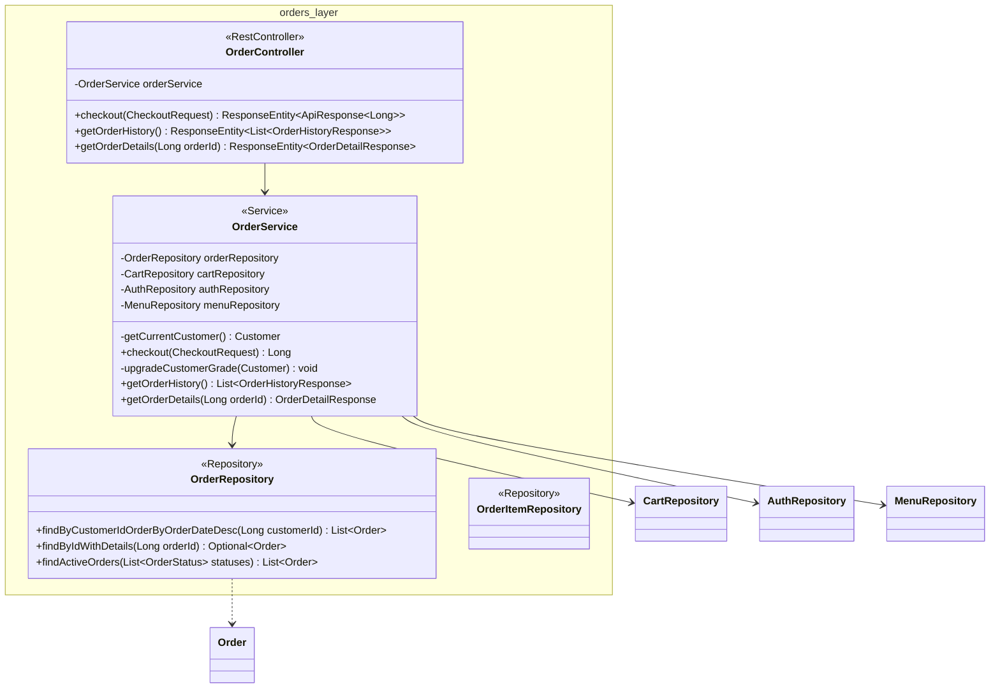
```mermaid
classDiagram
    namespace orders_layer {
        class OrderController {
            <<RestController>>
            -OrderService orderService
            +checkout(CheckoutRequest) ResponseEntity~ApiResponse~Long~~
            +getOrderHistory() ResponseEntity~List~OrderHistoryResponse~~
            +getOrderDetails(Long orderId) ResponseEntity~OrderDetailResponse~
        }

        class OrderService {
            <<Service>>
            -OrderRepository orderRepository
            -CartRepository cartRepository
            -AuthRepository authRepository
            -MenuRepository menuRepository
            -getCurrentCustomer() Customer
            +checkout(CheckoutRequest) Long
            -upgradeCustomerGrade(Customer) void
            +getOrderHistory() List~OrderHistoryResponse~
            +getOrderDetails(Long orderId) OrderDetailResponse
        }

        class OrderRepository {
            <<Repository>>
            <<interface>>
            +findByCustomerIdOrderByOrderDateDesc(Long customerId) List~Order~
            +findByIdWithDetails(Long orderId) Optional~Order~
            +findActiveOrders(List~OrderStatus~ statuses) List~Order~
        }

        class OrderItemRepository {
            <<Repository>>
            <<interface>>
        }
    }

    OrderController --> OrderService
    OrderService --> OrderRepository
    OrderService --> CartRepository
    OrderService --> AuthRepository
    OrderService --> MenuRepository
    OrderRepository ..> Order
```

---

## 6. Staff 패키지 상세 다이어그램

### 6.1 staff.entity

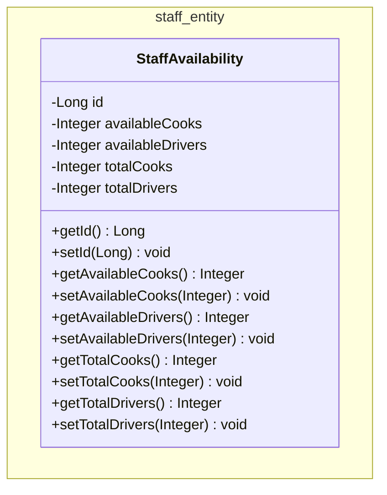
```mermaid
classDiagram
    namespace staff_entity {
        class StaffAvailability {
            -Long id
            -Integer availableCooks
            -Integer availableDrivers
            -Integer totalCooks
            -Integer totalDrivers
            +getId() Long
            +setId(Long) void
            +getAvailableCooks() Integer
            +setAvailableCooks(Integer) void
            +getAvailableDrivers() Integer
            +setAvailableDrivers(Integer) void
            +getTotalCooks() Integer
            +setTotalCooks(Integer) void
            +getTotalDrivers() Integer
            +setTotalDrivers(Integer) void
        }
    }
```

### 6.2 staff.dto

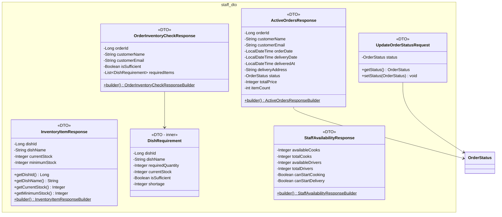
```mermaid
classDiagram
    namespace staff_dto {
        class ActiveOrdersResponse {
            <<DTO>>
            -Long orderId
            -String customerName
            -String customerEmail
            -LocalDateTime orderDate
            -LocalDateTime deliveryDate
            -LocalDateTime deliveredAt
            -String deliveryAddress
            -OrderStatus status
            -Integer totalPrice
            -int itemCount
            +builder()$ ActiveOrdersResponseBuilder
        }

        class UpdateOrderStatusRequest {
            <<DTO>>
            -OrderStatus status
            +getStatus() OrderStatus
            +setStatus(OrderStatus) void
        }

        class InventoryItemResponse {
            <<DTO>>
            -Long dishId
            -String dishName
            -Integer currentStock
            -Integer minimumStock
            +getDishId() Long
            +getDishName() String
            +getCurrentStock() Integer
            +getMinimumStock() Integer
            +builder()$ InventoryItemResponseBuilder
        }

        class OrderInventoryCheckResponse {
            <<DTO>>
            -Long orderId
            -String customerName
            -String customerEmail
            -Boolean isSufficient
            -List~DishRequirement~ requiredItems
            +builder()$ OrderInventoryCheckResponseBuilder
        }

        class DishRequirement {
            <<DTO - inner>>
            -Long dishId
            -String dishName
            -Integer requiredQuantity
            -Integer currentStock
            -Boolean isSufficient
            -Integer shortage
        }

        class StaffAvailabilityResponse {
            <<DTO>>
            -Integer availableCooks
            -Integer totalCooks
            -Integer availableDrivers
            -Integer totalDrivers
            -Boolean canStartCooking
            -Boolean canStartDelivery
            +builder()$ StaffAvailabilityResponseBuilder
        }
    }

    ActiveOrdersResponse --> OrderStatus
    UpdateOrderStatusRequest --> OrderStatus
    OrderInventoryCheckResponse --> DishRequirement
```

### 6.3 staff.controller, service, repository

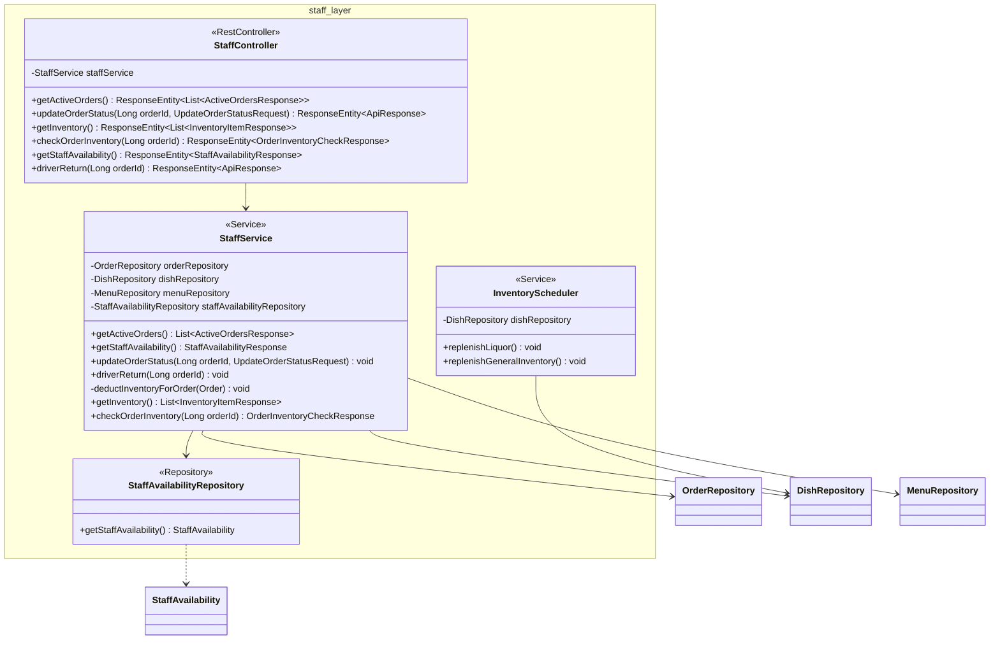
```mermaid
classDiagram
    namespace staff_layer {
        class StaffController {
            <<RestController>>
            -StaffService staffService
            +getActiveOrders() ResponseEntity~List~ActiveOrdersResponse~~
            +updateOrderStatus(Long orderId, UpdateOrderStatusRequest) ResponseEntity~ApiResponse~
            +getInventory() ResponseEntity~List~InventoryItemResponse~~
            +checkOrderInventory(Long orderId) ResponseEntity~OrderInventoryCheckResponse~
            +getStaffAvailability() ResponseEntity~StaffAvailabilityResponse~
            +driverReturn(Long orderId) ResponseEntity~ApiResponse~
        }

        class StaffService {
            <<Service>>
            -OrderRepository orderRepository
            -DishRepository dishRepository
            -MenuRepository menuRepository
            -StaffAvailabilityRepository staffAvailabilityRepository
            +getActiveOrders() List~ActiveOrdersResponse~
            +getStaffAvailability() StaffAvailabilityResponse
            +updateOrderStatus(Long orderId, UpdateOrderStatusRequest) void
            +driverReturn(Long orderId) void
            -deductInventoryForOrder(Order) void
            +getInventory() List~InventoryItemResponse~
            +checkOrderInventory(Long orderId) OrderInventoryCheckResponse
        }

        class InventoryScheduler {
            <<Service>>
            -DishRepository dishRepository
            +replenishLiquor() void
            +replenishGeneralInventory() void
        }

        class StaffAvailabilityRepository {
            <<Repository>>
            <<interface>>
            +getStaffAvailability() StaffAvailability
        }
    }

    StaffController --> StaffService
    StaffService --> OrderRepository
    StaffService --> DishRepository
    StaffService --> MenuRepository
    StaffService --> StaffAvailabilityRepository
    InventoryScheduler --> DishRepository
    StaffAvailabilityRepository ..> StaffAvailability
```

---

## 7. Config 패키지 상세 다이어그램

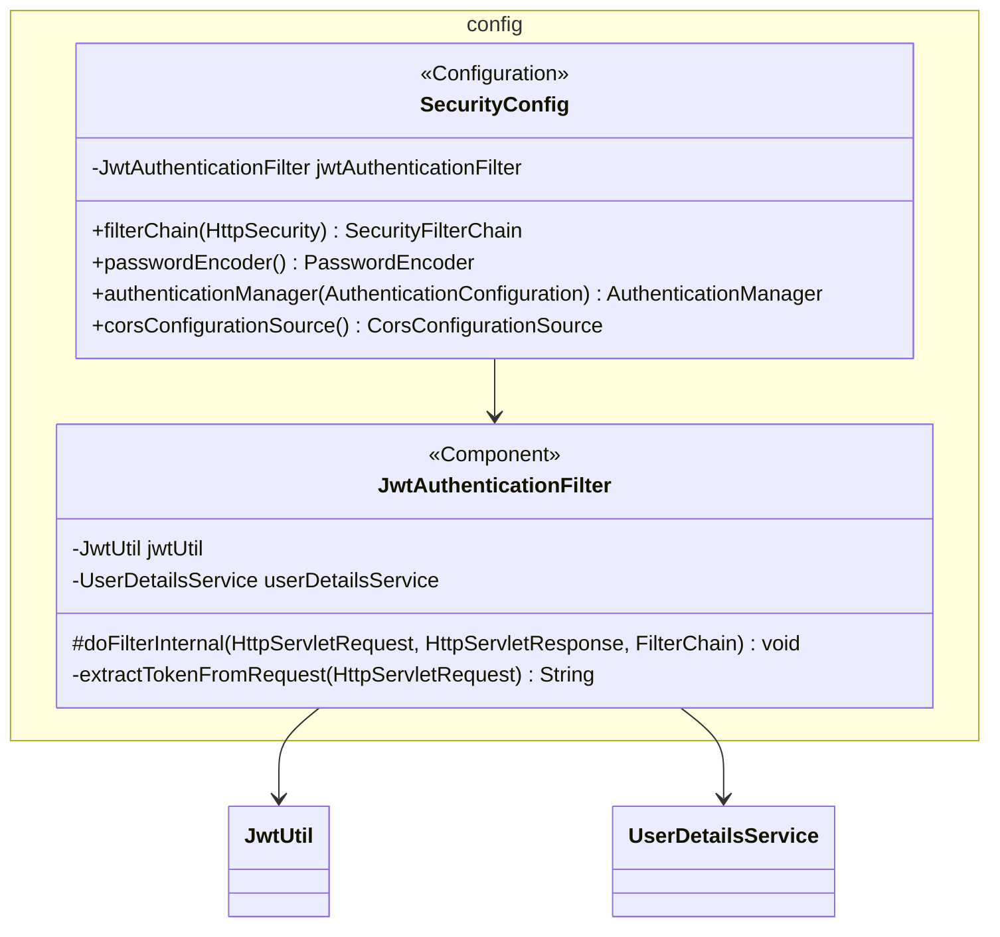
```mermaid
classDiagram
    namespace config {
        class SecurityConfig {
            <<Configuration>>
            -JwtAuthenticationFilter jwtAuthenticationFilter
            +filterChain(HttpSecurity) SecurityFilterChain
            +passwordEncoder() PasswordEncoder
            +authenticationManager(AuthenticationConfiguration) AuthenticationManager
            +corsConfigurationSource() CorsConfigurationSource
        }

        class JwtAuthenticationFilter {
            <<Component>>
            -JwtUtil jwtUtil
            -UserDetailsService userDetailsService
            #doFilterInternal(HttpServletRequest, HttpServletResponse, FilterChain) void
            -extractTokenFromRequest(HttpServletRequest) String
        }
    }

    SecurityConfig --> JwtAuthenticationFilter
    JwtAuthenticationFilter --> JwtUtil
    JwtAuthenticationFilter --> UserDetailsService
```

---

## 8. Common 패키지 상세 다이어그램

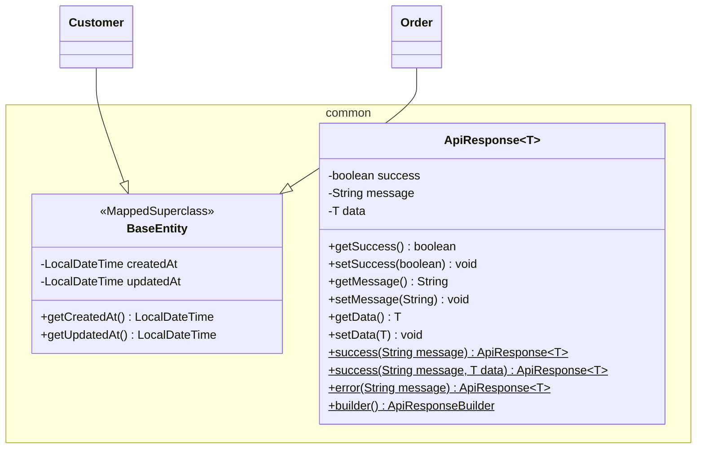
```mermaid
classDiagram
    namespace common {
        class BaseEntity {
            <<MappedSuperclass>>
            -LocalDateTime createdAt
            -LocalDateTime updatedAt
            +getCreatedAt() LocalDateTime
            +getUpdatedAt() LocalDateTime
        }

        class ApiResponse~T~ {
            -boolean success
            -String message
            -T data
            +getSuccess() boolean
            +setSuccess(boolean) void
            +getMessage() String
            +setMessage(String) void
            +getData() T
            +setData(T) void
            +success(String message)$ ApiResponse~T~
            +success(String message, T data)$ ApiResponse~T~
            +error(String message)$ ApiResponse~T~
            +builder()$ ApiResponseBuilder
        }
    }

    Customer --|> BaseEntity
    Order --|> BaseEntity
```

---

## 9. Exception 패키지 상세 다이어그램

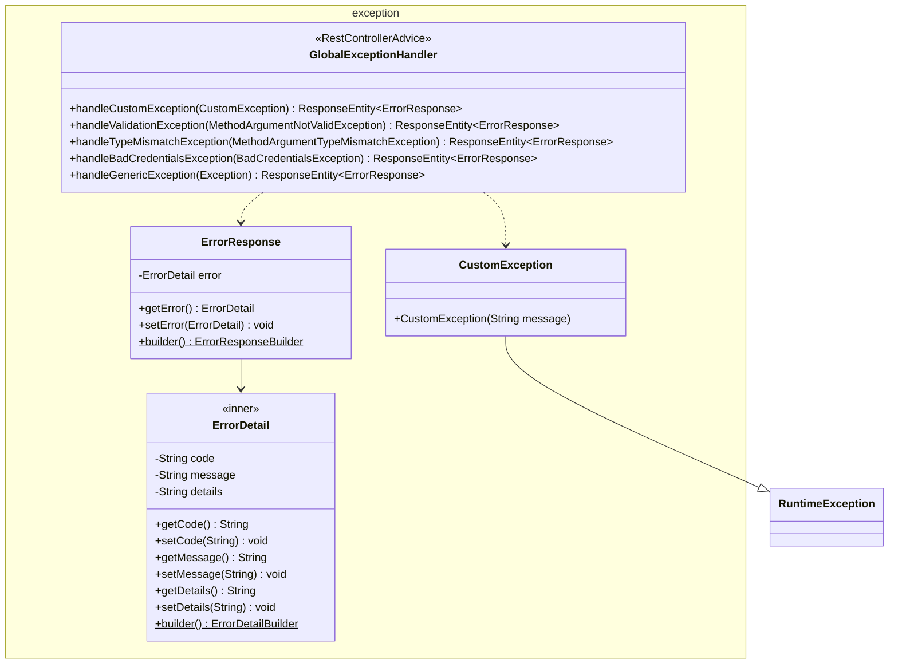
```mermaid
classDiagram
    namespace exception {
        class CustomException {
            +CustomException(String message)
        }

        class ErrorResponse {
            -ErrorDetail error
            +getError() ErrorDetail
            +setError(ErrorDetail) void
            +builder()$ ErrorResponseBuilder
        }

        class ErrorDetail {
            <<inner>>
            -String code
            -String message
            -String details
            +getCode() String
            +setCode(String) void
            +getMessage() String
            +setMessage(String) void
            +getDetails() String
            +setDetails(String) void
            +builder()$ ErrorDetailBuilder
        }

        class GlobalExceptionHandler {
            <<RestControllerAdvice>>
            +handleCustomException(CustomException) ResponseEntity~ErrorResponse~
            +handleValidationException(MethodArgumentNotValidException) ResponseEntity~ErrorResponse~
            +handleTypeMismatchException(MethodArgumentTypeMismatchException) ResponseEntity~ErrorResponse~
            +handleBadCredentialsException(BadCredentialsException) ResponseEntity~ErrorResponse~
            +handleGenericException(Exception) ResponseEntity~ErrorResponse~
        }
    }

    CustomException --|> RuntimeException
    ErrorResponse --> ErrorDetail
    GlobalExceptionHandler ..> ErrorResponse
    GlobalExceptionHandler ..> CustomException
```

---

## 10. 전체 엔티티 관계 다이어그램 (ERD 스타일)

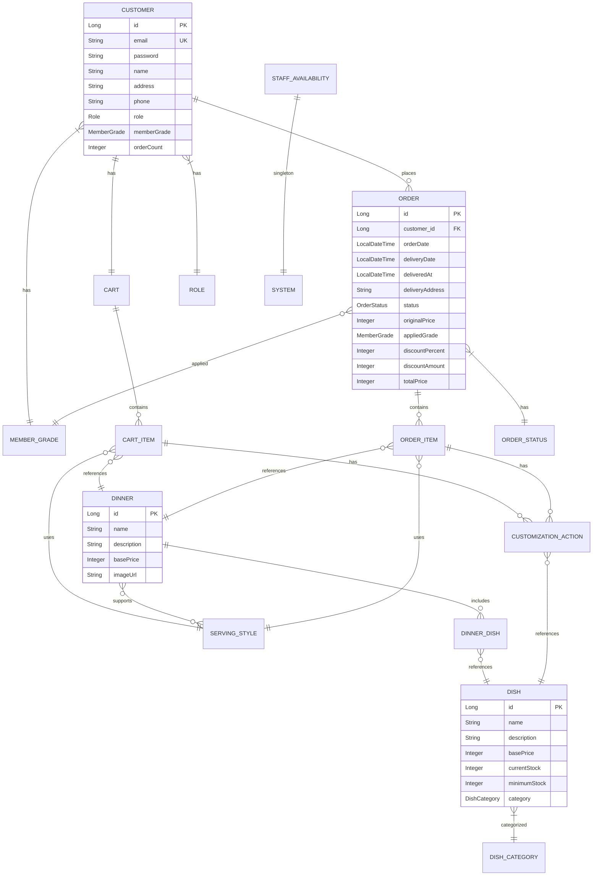
```mermaid
erDiagram
    CUSTOMER ||--o{ ORDER : places
    CUSTOMER ||--|| CART : has
    CUSTOMER }|--|| MEMBER_GRADE : has
    CUSTOMER }|--|| ROLE : has

    CART ||--o{ CART_ITEM : contains
    CART_ITEM }o--|| DINNER : references
    CART_ITEM }o--|| SERVING_STYLE : uses
    CART_ITEM ||--o{ CUSTOMIZATION_ACTION : has

    DINNER ||--o{ DINNER_DISH : includes
    DINNER }o--o{ SERVING_STYLE : supports
    DINNER_DISH }o--|| DISH : references
    DISH }|--|| DISH_CATEGORY : categorized

    ORDER ||--o{ ORDER_ITEM : contains
    ORDER }|--|| ORDER_STATUS : has
    ORDER }o--|| MEMBER_GRADE : applied
    ORDER_ITEM }o--|| DINNER : references
    ORDER_ITEM }o--|| SERVING_STYLE : uses
    ORDER_ITEM ||--o{ CUSTOMIZATION_ACTION : has
    CUSTOMIZATION_ACTION }o--|| DISH : references

    STAFF_AVAILABILITY ||--|| SYSTEM : singleton

    CUSTOMER {
        Long id PK
        String email UK
        String password
        String name
        String address
        String phone
        Role role
        MemberGrade memberGrade
        Integer orderCount
    }

    ORDER {
        Long id PK
        Long customer_id FK
        LocalDateTime orderDate
        LocalDateTime deliveryDate
        LocalDateTime deliveredAt
        String deliveryAddress
        OrderStatus status
        Integer originalPrice
        MemberGrade appliedGrade
        Integer discountPercent
        Integer discountAmount
        Integer totalPrice
    }

    DINNER {
        Long id PK
        String name
        String description
        Integer basePrice
        String imageUrl
    }

    DISH {
        Long id PK
        String name
        String description
        Integer basePrice
        Integer currentStock
        Integer minimumStock
        DishCategory category
    }
```

---

## 11. 레이어드 아키텍처 다이어그램

```mermaid
flowchart TB
    subgraph Presentation["Presentation Layer"]
        AC[AuthController]
        CC[CartController]
        MC[MenuController]
        OC[OrderController]
        SC[StaffController]
    end

    subgraph Service["Service Layer"]
        AS[AuthService]
        CS[CartService]
        MS[MenuService]
        OS[OrderService]
        SS[StaffService]
        IS[InventoryScheduler]
        CUDS[CustomUserDetailsService]
    end

    subgraph Repository["Repository Layer"]
        AR[AuthRepository]
        CR[CartRepository]
        CIR[CartItemRepository]
        MR[MenuRepository]
        OR[OrderRepository]
        DR[DishRepository]
        SSR[ServingStyleRepository]
        SAR[StaffAvailabilityRepository]
    end

    subgraph Entity["Entity Layer"]
        direction LR
        Customer
        Cart
        CartItem
        Dinner
        Dish
        Order
        OrderItem
        StaffAvailability
    end

    subgraph Security["Security Layer"]
        SecConfig[SecurityConfig]
        JwtFilter[JwtAuthenticationFilter]
        JwtUtil
    end

    AC --> AS
    CC --> CS
    MC --> MS
    OC --> OS
    SC --> SS

    AS --> AR
    CS --> CR
    CS --> CIR
    CS --> DR
    MS --> MR
    OS --> OR
    OS --> CR
    OS --> AR
    SS --> OR
    SS --> DR
    SS --> SAR
    IS --> DR
    CUDS --> AR

    SecConfig --> JwtFilter
    JwtFilter --> JwtUtil
    JwtFilter --> CUDS

    AR --> Customer
    CR --> Cart
    CIR --> CartItem
    MR --> Dinner
    DR --> Dish
    OR --> Order
    SAR --> StaffAvailability
```
