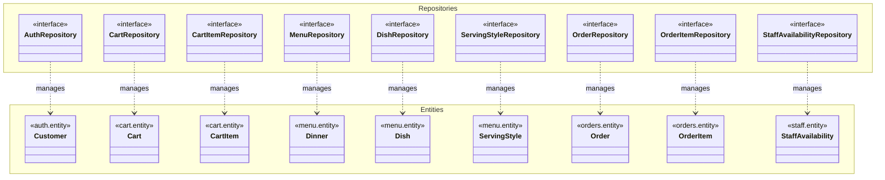

# DDogan-zip 레이어별 클래스 다이어그램

> Mermaid Playground: [https://mermaid.live](https://mermaid.live)

---

## 1. Controller - Service - Repository 통합 다이어그램

```mermaid
classDiagram
    %% ==================== CONTROLLERS ====================
    namespace Controllers {
        class AuthController {
            <<auth.controller>>
            -AuthService authService
            +register(RegisterRequest) ResponseEntity
            +login(LoginRequest) ResponseEntity
            +refresh(RefreshTokenRequest) ResponseEntity
            +logout() ResponseEntity
            +getMe(Authentication) ResponseEntity
        }

        class CartController {
            <<cart.controller>>
            -CartService cartService
            +getCart() ResponseEntity
            +addItemToCart(AddToCartRequest) ResponseEntity
            +updateItemQuantity(Long, UpdateQuantityRequest) ResponseEntity
            +updateItemOptions(Long, UpdateOptionsRequest) ResponseEntity
            +removeItem(Long) ResponseEntity
            +customizeCartItem(Long, CustomizeCartItemRequest) ResponseEntity
        }

        class MenuController {
            <<menu.controller>>
            -MenuService menuService
            +getMenuList() ResponseEntity
            +getMenuDetails(Long) ResponseEntity
        }

        class OrderController {
            <<orders.controller>>
            -OrderService orderService
            +checkout(CheckoutRequest) ResponseEntity
            +getOrderHistory() ResponseEntity
            +getOrderDetails(Long) ResponseEntity
        }

        class StaffController {
            <<staff.controller>>
            -StaffService staffService
            +getActiveOrders() ResponseEntity
            +updateOrderStatus(Long, UpdateOrderStatusRequest) ResponseEntity
            +getInventory() ResponseEntity
            +checkOrderInventory(Long) ResponseEntity
            +getStaffAvailability() ResponseEntity
            +driverReturn(Long) ResponseEntity
        }
    }

    %% ==================== SERVICES ====================
    namespace Services {
        class AuthService {
            <<auth.service>>
            -AuthRepository authRepository
            -PasswordEncoder passwordEncoder
            -JwtUtil jwtUtil
            -AuthenticationManager authenticationManager
            +register(RegisterRequest) void
            +login(LoginRequest) TokenResponse
            +refresh(RefreshTokenRequest) TokenResponse
            +getMe(String) MeResponse
        }

        class CustomUserDetailsService {
            <<auth.service>>
            -AuthRepository authRepository
            +loadUserByUsername(String) UserDetails
        }

        class CartService {
            <<cart.service>>
            -CartRepository cartRepository
            -CartItemRepository cartItemRepository
            -MenuRepository menuRepository
            -ServingStyleRepository servingStyleRepository
            -DishRepository dishRepository
            -AuthRepository authRepository
            -getCurrentCustomer() Customer
            +getCart() CartResponse
            +addItemToCart(AddToCartRequest) void
            +updateItemQuantity(Long, UpdateQuantityRequest) void
            +updateItemOptions(Long, UpdateOptionsRequest) void
            +removeItem(Long) void
            +customizeCartItem(Long, CustomizeCartItemRequest) void
        }

        class MenuService {
            <<menu.service>>
            -MenuRepository menuRepository
            +getMenuList() List~MenuListResponse~
            +getMenuDetails(Long) MenuDetailResponse
        }

        class OrderService {
            <<orders.service>>
            -OrderRepository orderRepository
            -CartRepository cartRepository
            -AuthRepository authRepository
            -MenuRepository menuRepository
            -getCurrentCustomer() Customer
            +checkout(CheckoutRequest) Long
            -upgradeCustomerGrade(Customer) void
            +getOrderHistory() List~OrderHistoryResponse~
            +getOrderDetails(Long) OrderDetailResponse
        }

        class StaffService {
            <<staff.service>>
            -OrderRepository orderRepository
            -DishRepository dishRepository
            -MenuRepository menuRepository
            -StaffAvailabilityRepository staffAvailabilityRepository
            +getActiveOrders() List~ActiveOrdersResponse~
            +getStaffAvailability() StaffAvailabilityResponse
            +updateOrderStatus(Long, UpdateOrderStatusRequest) void
            +driverReturn(Long) void
            -deductInventoryForOrder(Order) void
            +getInventory() List~InventoryItemResponse~
            +checkOrderInventory(Long) OrderInventoryCheckResponse
        }

        class InventoryScheduler {
            <<staff.service>>
            -DishRepository dishRepository
            +replenishLiquor() void
            +replenishGeneralInventory() void
        }
    }

    %% ==================== REPOSITORIES ====================
    namespace Repositories {
        class AuthRepository {
            <<auth.repository>>
            +findByEmail(String) Optional~Customer~
            +existsByEmail(String) boolean
            +save(Customer) Customer
        }

        class CartRepository {
            <<cart.repository>>
            +findByCustomerIdWithItems(Long) Optional~Cart~
            +findByCustomerId(Long) Optional~Cart~
        }

        class CartItemRepository {
            <<cart.repository>>
            +findByIdWithCustomizations(Long) Optional~CartItem~
        }

        class DishRepository {
            <<cart.repository>>
            +findById(Long) Optional~Dish~
            +findAll() List~Dish~
            +save(Dish) Dish
        }

        class ServingStyleRepository {
            <<cart.repository>>
            +findById(Long) Optional~ServingStyle~
        }

        class MenuRepository {
            <<menu.repository>>
            +findAll() List~Dinner~
            +findAllWithDishes() List~Dinner~
            +findDinnersWithStyles(List~Dinner~) List~Dinner~
            +findByIdWithDishes(Long) Optional~Dinner~
            +findByIdWithStyles(Long) Optional~Dinner~
        }

        class OrderRepository {
            <<orders.repository>>
            +findByCustomerIdOrderByOrderDateDesc(Long) List~Order~
            +findByIdWithDetails(Long) Optional~Order~
            +findActiveOrders(List~OrderStatus~) List~Order~
            +findById(Long) Optional~Order~
            +save(Order) Order
        }

        class OrderItemRepository {
            <<orders.repository>>
        }

        class StaffAvailabilityRepository {
            <<staff.repository>>
            +getStaffAvailability() StaffAvailability
            +save(StaffAvailability) StaffAvailability
        }
    }

    %% ==================== CONTROLLER → SERVICE ====================
    AuthController --> AuthService
    CartController --> CartService
    MenuController --> MenuService
    OrderController --> OrderService
    StaffController --> StaffService

    %% ==================== SERVICE → REPOSITORY (같은 패키지) ====================
    AuthService --> AuthRepository
    CustomUserDetailsService --> AuthRepository
    CartService --> CartRepository
    CartService --> CartItemRepository
    MenuService --> MenuRepository
    OrderService --> OrderRepository
    StaffService --> StaffAvailabilityRepository

    %% ==================== SERVICE → REPOSITORY (다른 패키지) ====================
    CartService --> AuthRepository : 고객 조회
    CartService --> MenuRepository : 디너 조회
    CartService --> DishRepository : 요리 조회
    CartService --> ServingStyleRepository : 서빙 스타일 조회

    OrderService --> AuthRepository : 고객 조회/등급 업데이트
    OrderService --> CartRepository : 장바구니 조회/비우기
    OrderService --> MenuRepository : 디너 정보 조회

    StaffService --> OrderRepository : 주문 조회/수정
    StaffService --> DishRepository : 재고 조회/차감
    StaffService --> MenuRepository : 디너-요리 매핑 조회

    InventoryScheduler --> DishRepository : 재고 충전
```

---

## 2. 의존성 흐름 다이어그램

---

## 3. 크로스 패키지 의존성 상세

---

## 4. Repository가 반환하는 Entity 매핑

---

## 5. 요약 테이블

### 5.1 Service → Repository 의존성 매트릭스

| Service | AuthRepo | CartRepo | CartItemRepo | MenuRepo | DishRepo | ServingStyleRepo | OrderRepo | StaffAvailRepo |
|---------|:--------:|:--------:|:------------:|:--------:|:--------:|:----------------:|:---------:|:--------------:|
| **AuthService** | ✅ | | | | | | | |
| **CustomUserDetailsService** | ✅ | | | | | | | |
| **CartService** | ✅ | ✅ | ✅ | ✅ | ✅ | ✅ | | |
| **MenuService** | | | | ✅ | | | | |
| **OrderService** | ✅ | ✅ | | ✅ | | | ✅ | |
| **StaffService** | | | | ✅ | ✅ | | ✅ | ✅ |
| **InventoryScheduler** | | | | | ✅ | | | |

### 5.2 Controller → Service 매핑

| Controller | Service | 주요 기능 |
|------------|---------|----------|
| AuthController | AuthService | 회원가입, 로그인, 토큰 갱신, 프로필 조회 |
| CartController | CartService | 장바구니 CRUD, 커스터마이징 |
| MenuController | MenuService | 메뉴 목록, 상세 조회 |
| OrderController | OrderService | 주문 생성, 주문 내역 조회 |
| StaffController | StaffService | 주문 관리, 재고 관리, 직원 가용성 |
