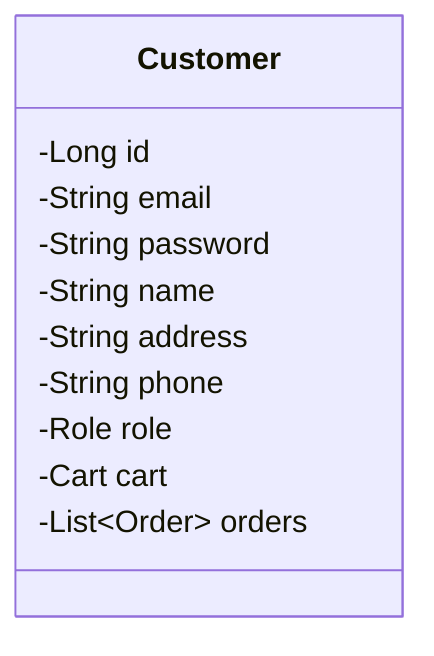
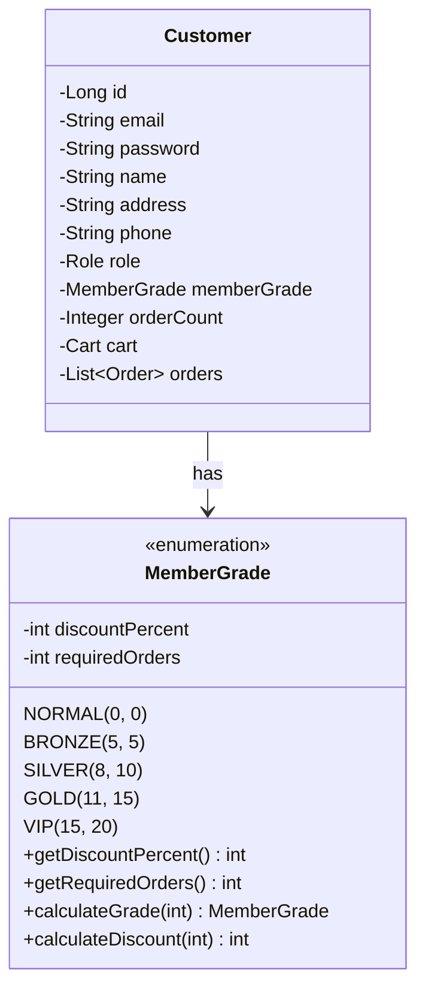
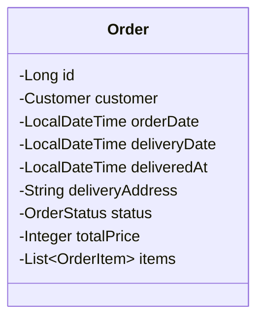
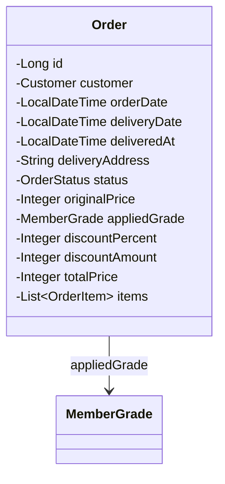
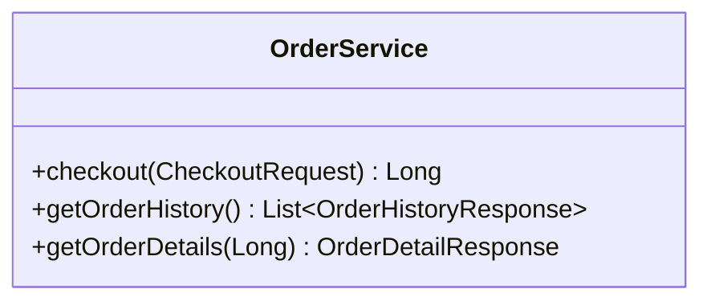
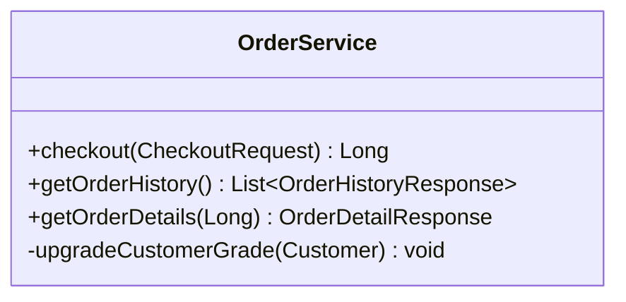
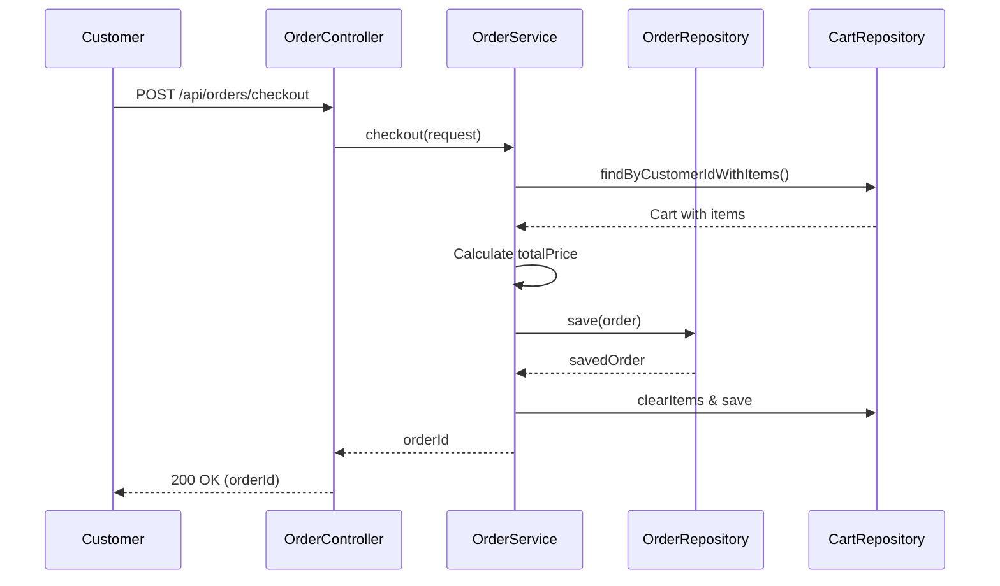
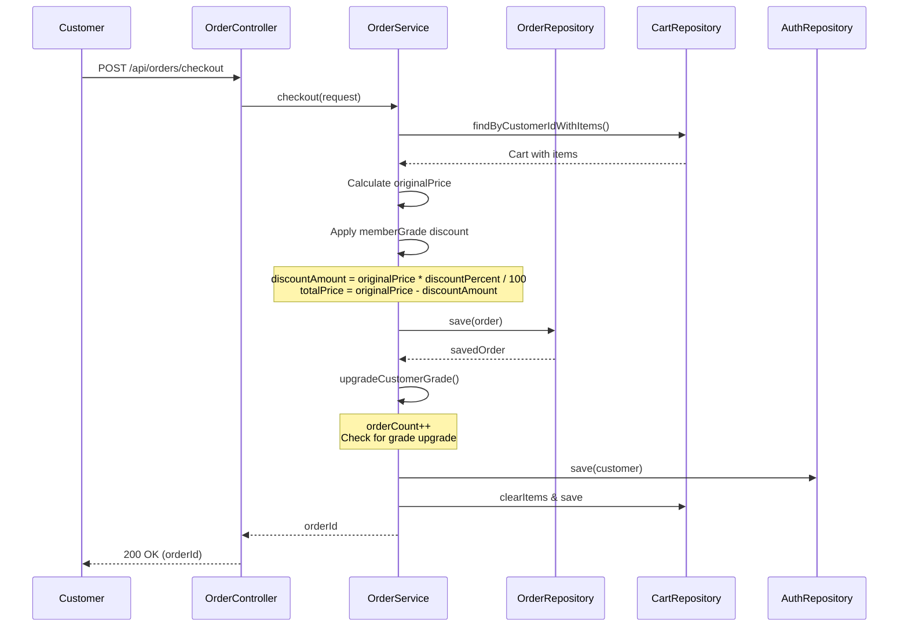

# 회원 등급 할인 기능 변경사항

## 1. 기능 개요

### 등급 체계
| 등급 | 할인율 | 승급 기준 (주문 횟수) |
|------|--------|----------------------|
| NORMAL (일반) | 0% | 0회 |
| BRONZE (브론즈) | 5% | 5회 |
| SILVER (실버) | 8% | 10회 |
| GOLD (골드) | 11% | 15회 |
| VIP | 15% | 20회 |

### 주요 기능
1. 주문 시 현재 회원 등급에 따른 할인 자동 적용
2. 주문 완료 후 주문 횟수 증가 및 자동 등급 승급

---

## 2. 변경된 파일 목록

### 새로 추가된 파일
| 파일 | 설명 |
|------|------|
| `auth/entity/MemberGrade.java` | 회원 등급 enum (할인율, 승급 기준 포함) |

### 수정된 파일
| 파일 | 변경 내용 |
|------|----------|
| `auth/entity/Customer.java` | `memberGrade`, `orderCount` 필드 추가 |
| `customers/orders/entity/Order.java` | `originalPrice`, `appliedGrade`, `discountPercent`, `discountAmount` 필드 추가 |
| `customers/orders/service/OrderService.java` | 할인 적용 로직, 등급 승급 로직 추가 |
| `customers/orders/dto/OrderHistoryResponse.java` | 할인 정보 필드 추가 |
| `customers/orders/dto/OrderDetailResponse.java` | 할인 정보 필드 추가 |
| `resources/data.sql` | 새 컬럼 데이터 추가 |

---

## 3. 다이어그램 변경사항

### 3.1 Entity Class Diagram 변경

#### Before (Customer)


#### After (Customer)


#### Before (Order)


#### After (Order)


### 3.2 Service Layer 변경

#### Before (OrderService)


#### After (OrderService)


### 3.3 Checkout 시퀀스 다이어그램 변경

#### Before


#### After


---

## 4. API Response 변경사항

### 4.1 OrderHistoryResponse

#### Before
```json
{
  "orderId": 1,
  "orderDate": "2025-11-18T17:00:00",
  "deliveryDate": "2025-11-18T19:30:00",
  "deliveredAt": null,
  "deliveryAddress": "서울시 강남구",
  "status": "RECEIVED",
  "totalPrice": 84000,
  "itemCount": 2
}
```

#### After
```json
{
  "orderId": 1,
  "orderDate": "2025-11-18T17:00:00",
  "deliveryDate": "2025-11-18T19:30:00",
  "deliveredAt": null,
  "deliveryAddress": "서울시 강남구",
  "status": "RECEIVED",
  "originalPrice": 84000,
  "appliedGrade": "NORMAL",
  "discountPercent": 0,
  "discountAmount": 0,
  "totalPrice": 84000,
  "itemCount": 2
}
```

### 4.2 OrderDetailResponse

#### Before
```json
{
  "orderId": 1,
  "orderDate": "2025-11-18T17:00:00",
  "status": "RECEIVED",
  "totalPrice": 84000,
  "items": [...]
}
```

#### After
```json
{
  "orderId": 1,
  "orderDate": "2025-11-18T17:00:00",
  "status": "RECEIVED",
  "originalPrice": 84000,
  "appliedGrade": "NORMAL",
  "discountPercent": 0,
  "discountAmount": 0,
  "totalPrice": 84000,
  "items": [...]
}
```

---

## 5. 새로 추가된 필드 상세

### MemberGrade enum
| 필드/메서드 | 타입 | 설명 |
|------------|------|------|
| `discountPercent` | int | 해당 등급의 할인율 (%) |
| `requiredOrders` | int | 해당 등급 달성에 필요한 주문 횟수 |
| `getDiscountPercent()` | int | 할인율 반환 |
| `getRequiredOrders()` | int | 필요 주문 횟수 반환 |
| `calculateGrade(int)` | MemberGrade | 주문 횟수로 등급 계산 |
| `calculateDiscount(int)` | int | 원가에서 할인 금액 계산 |

### Customer 추가 필드
| 필드 | 타입 | 설명 | 기본값 |
|------|------|------|--------|
| `memberGrade` | MemberGrade | 회원 등급 | NORMAL |
| `orderCount` | Integer | 누적 주문 횟수 | 0 |

### Order 추가 필드
| 필드 | 타입 | 설명 |
|------|------|------|
| `originalPrice` | Integer | 할인 전 원가 |
| `appliedGrade` | MemberGrade | 주문 시 적용된 등급 |
| `discountPercent` | Integer | 적용된 할인율 (%) |
| `discountAmount` | Integer | 할인 금액 (원) |

---

## 6. 사용 예시

### 할인 계산 예시
```
고객: john@test.com (SILVER 등급, 8% 할인)
주문: French Dinner (48,000원) + Grand 스타일 (15,000원) x 2개

원가: (48,000 + 15,000) × 2 = 126,000원
할인 금액: 126,000 × 8% = 10,080원
최종 결제 금액: 126,000 - 10,080 = 115,920원
```

### 등급 승급 예시
```
고객 현재 상태: orderCount = 9, memberGrade = BRONZE
→ 주문 완료
→ orderCount = 10, memberGrade = SILVER (자동 승급!)
```
