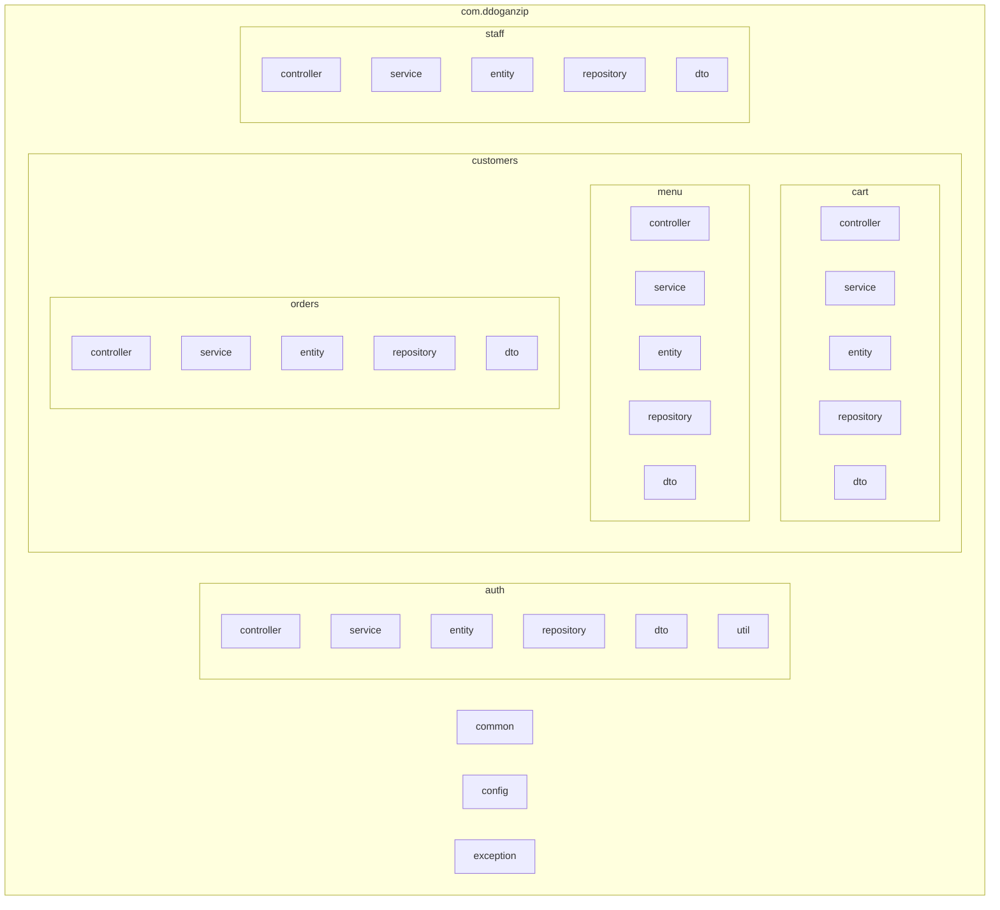
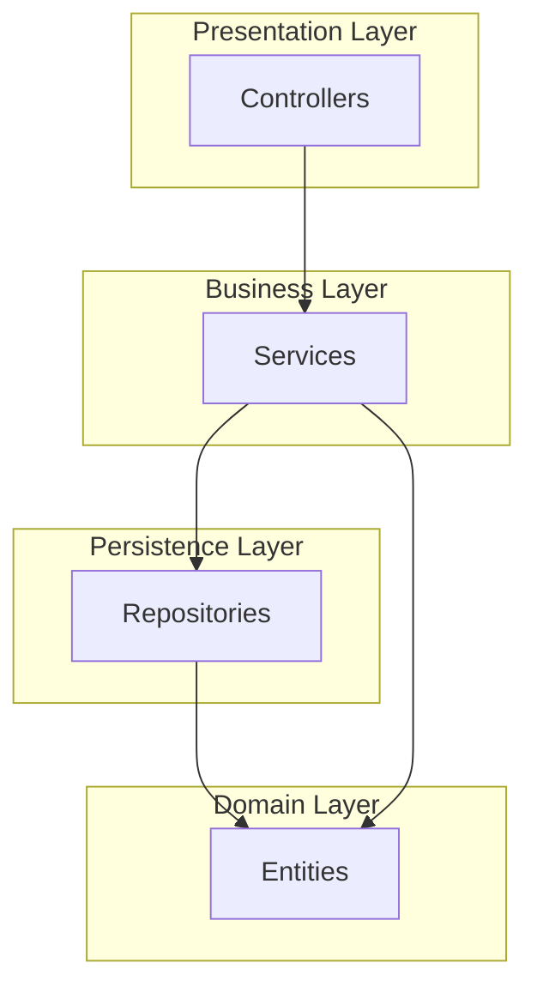

# Package Diagram

This document contains the Mermaid package diagram for the DDogan Zip backend system.

## Package Hierarchy

## Layered Architecture

## Package Summary

| Package | Description |
|---------|-------------|
| `auth` | Authentication & Authorization |
| `customers.cart` | Shopping cart management |
| `customers.menu` | Menu browsing |
| `customers.orders` | Order processing |
| `staff` | Staff operations & inventory |
| `common` | Shared base classes |
| `config` | Security configuration |
| `exception` | Exception handling |
