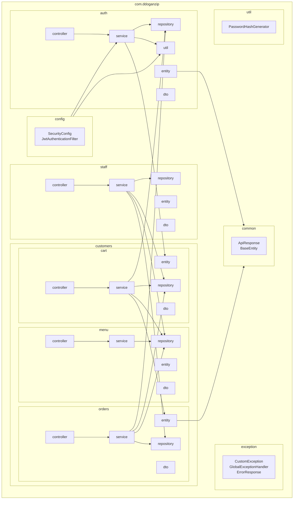
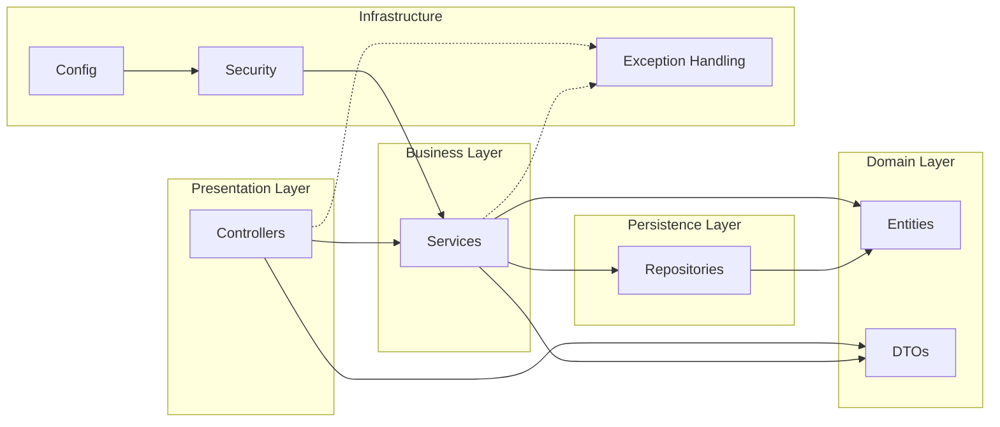
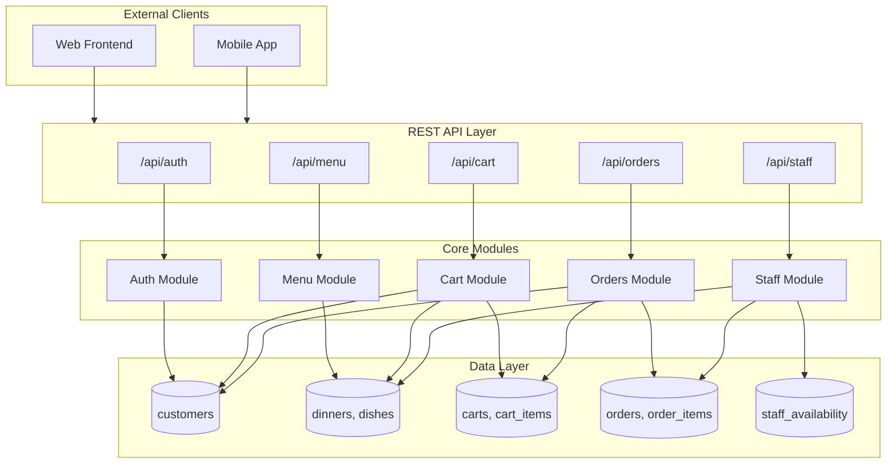

# Package Diagram

This document contains the Mermaid package diagram for the DDogan Zip backend system.

## System Package Structure

## Package Dependency Overview

## Module Dependencies

## Package Details

| Package | Description | Key Classes |
|---------|-------------|-------------|
| `auth` | Authentication & Authorization | AuthController, AuthService, Customer, JwtUtil |
| `common` | Shared base classes | ApiResponse, BaseEntity |
| `config` | Security & application configuration | SecurityConfig, JwtAuthenticationFilter |
| `customers.cart` | Shopping cart management | CartController, CartService, Cart, CartItem |
| `customers.menu` | Menu browsing | MenuController, MenuService, Dinner, Dish |
| `customers.orders` | Order processing | OrderController, OrderService, Order, OrderItem |
| `staff` | Staff operations & inventory | StaffController, StaffService, StaffAvailability |
| `exception` | Global exception handling | CustomException, GlobalExceptionHandler |
