# DdoganZip System Sequence Diagrams

## 1. Register

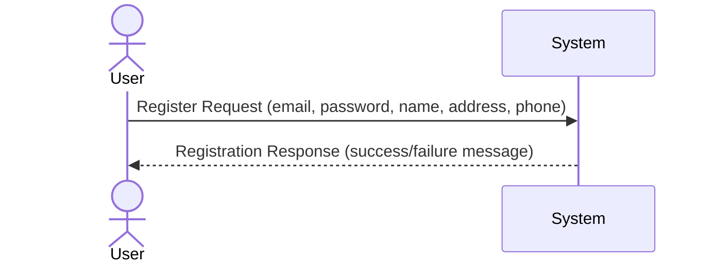

## 2. Login

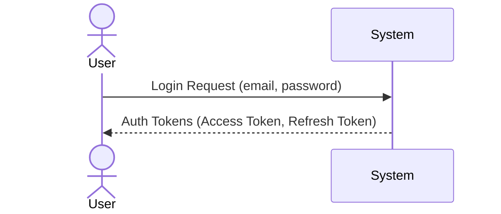

## 3. View Menu

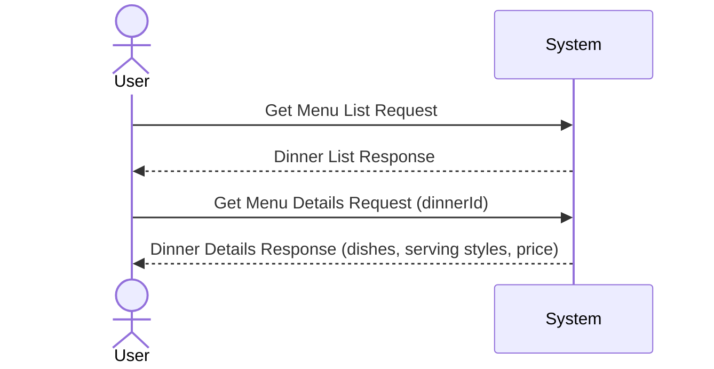

## 4. Manage Cart

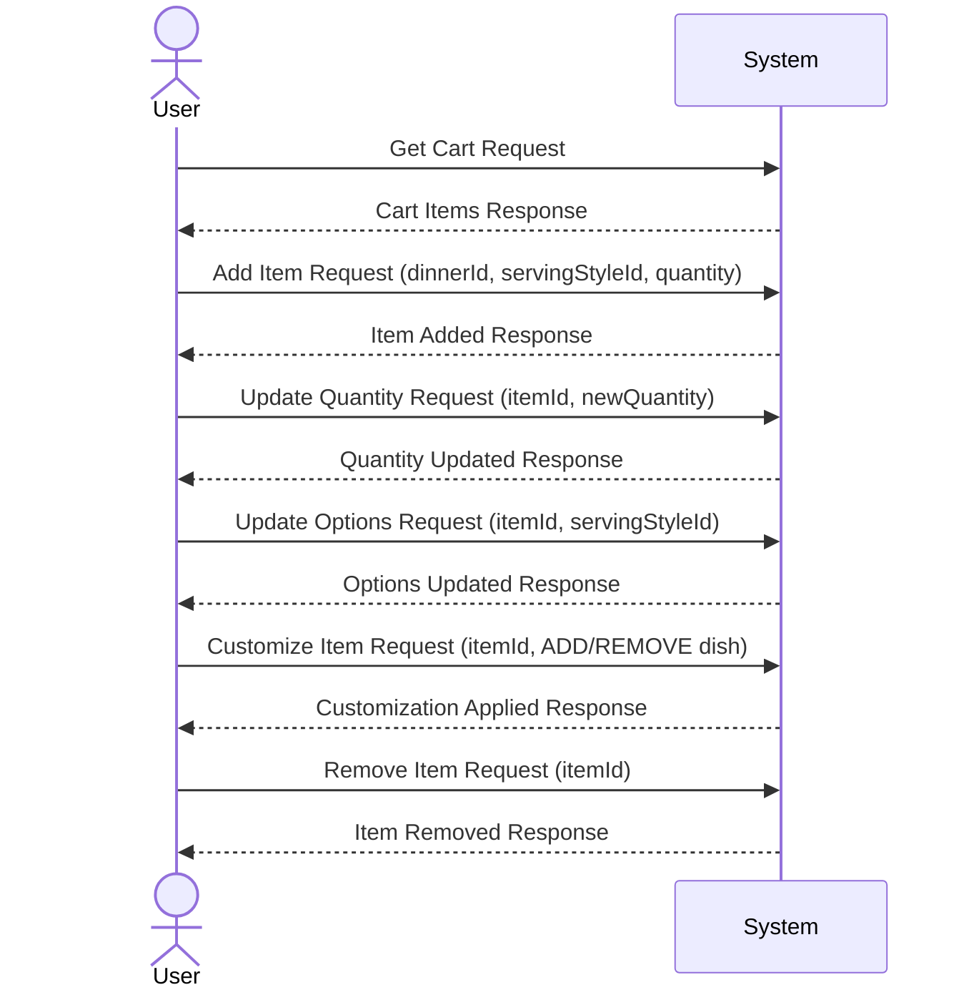

## 5. Checkout

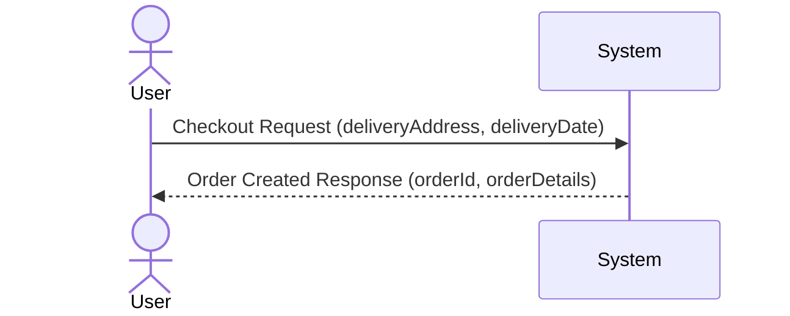

## 6. View Order

### 6-1. User - Order History

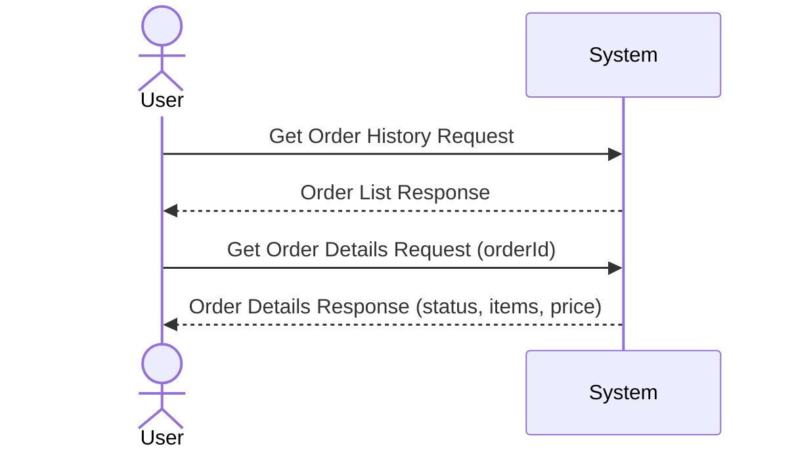

### 6-2. Staff - Active Orders

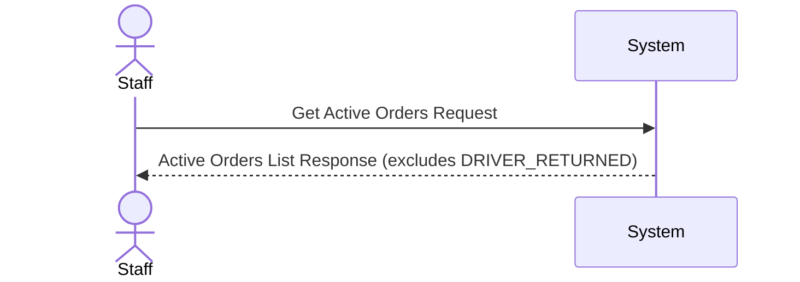

## 7. Manage Status (Staff)

### 7-1. Update Order Status

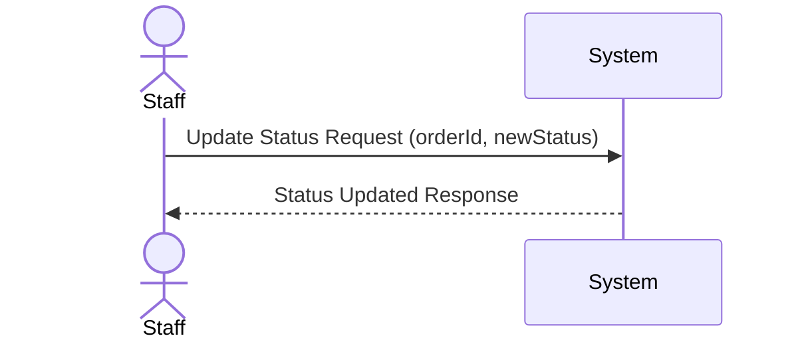

### 7-2. Check Inventory

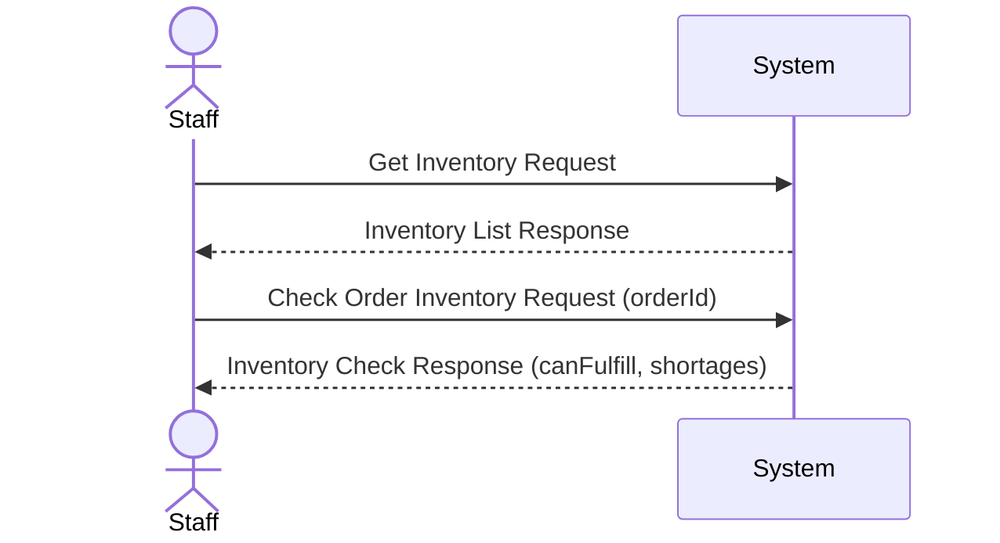

### 7-3. Driver Return

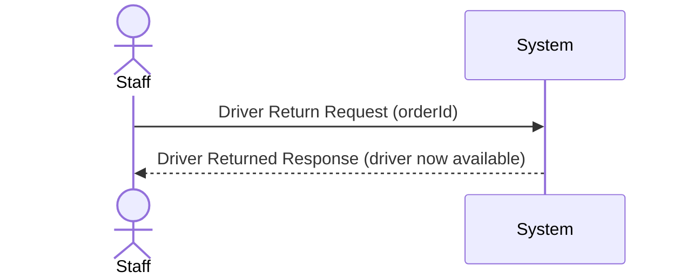

### 7-4. Staff Availability

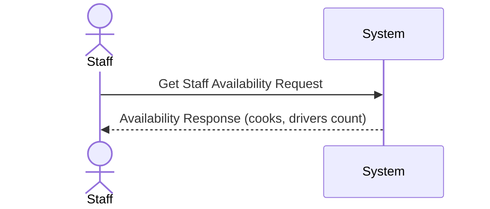
