# DdoganZip 시스템 시퀀스 다이어그램

## 1. Register (회원가입)

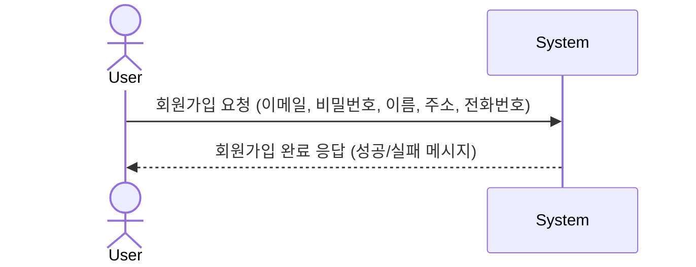

## 2. Login (로그인)

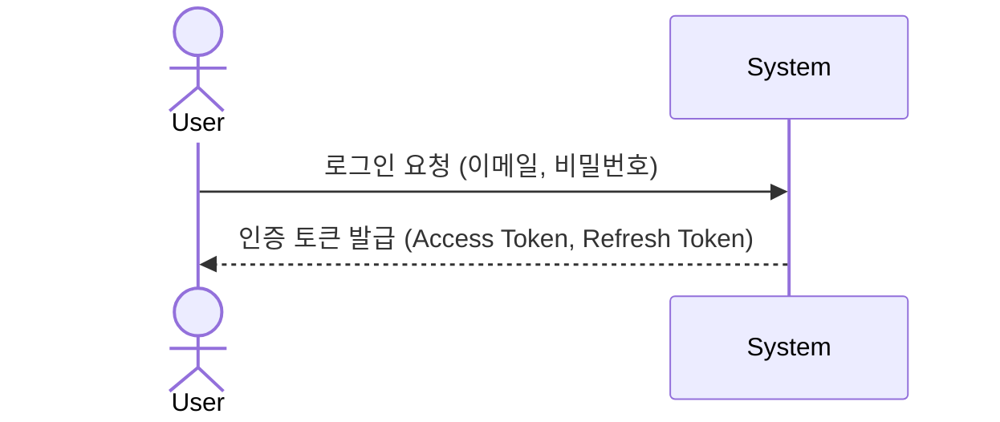

## 3. View Menu (메뉴 조회)

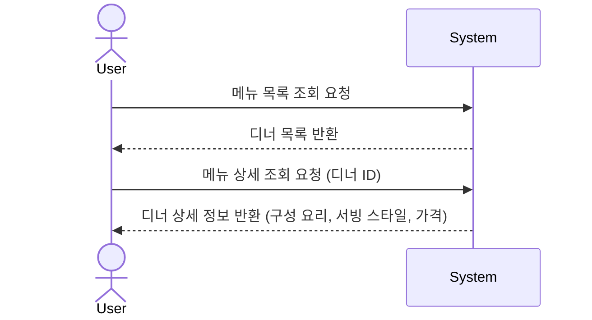

## 4. Manage Cart (장바구니 관리)

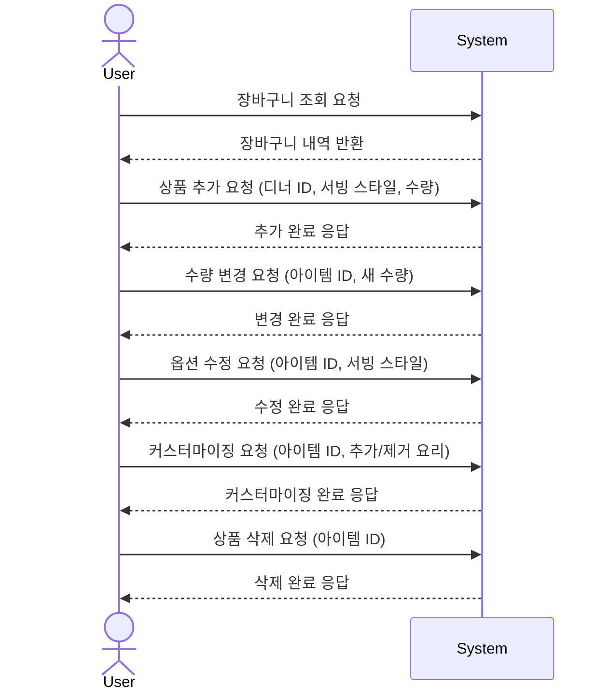

## 5. Checkout (주문하기)

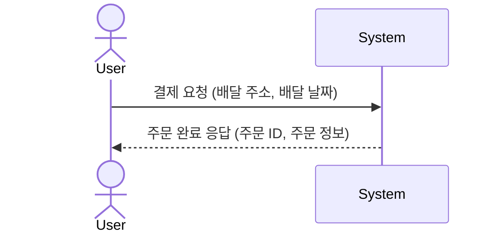

## 6. View Order (주문 조회)

### 6-1. 일반 사용자 - 주문 내역 조회

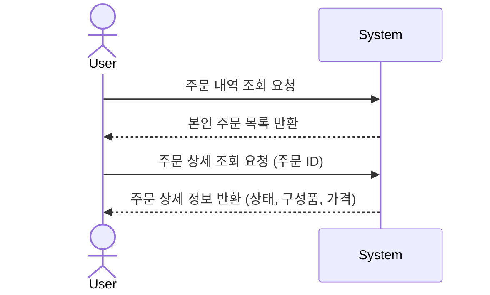

### 6-2. 스태프 - 활성 주문 조회

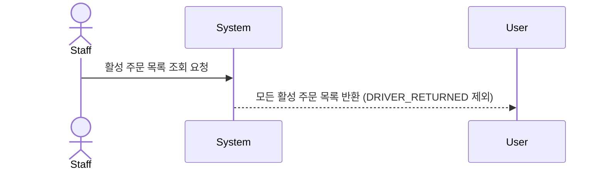

## 7. Manage Status (주문 상태 관리 - 스태프)

### 7-1. 주문 상태 변경

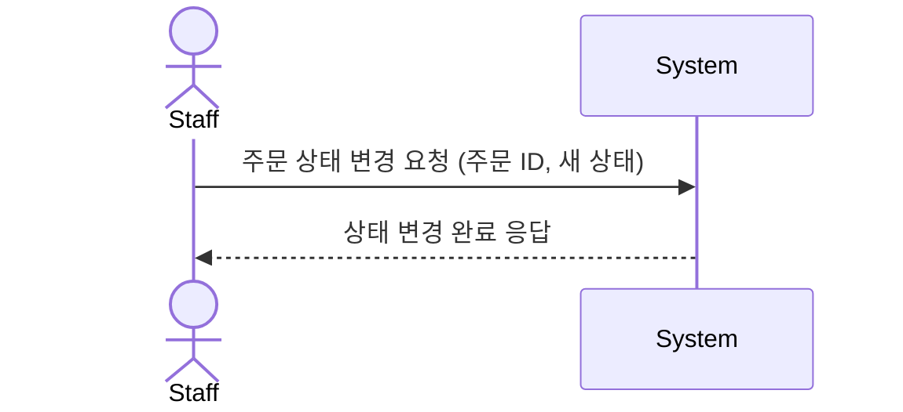

### 7-2. 재고 확인

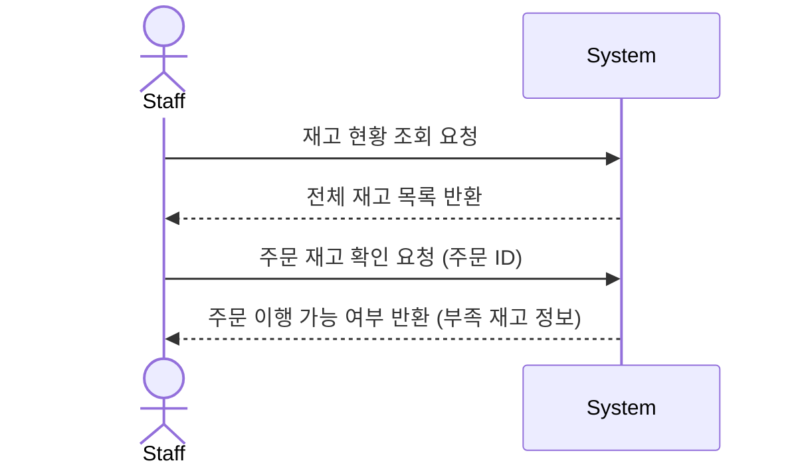

### 7-3. 배달 직원 복귀 처리

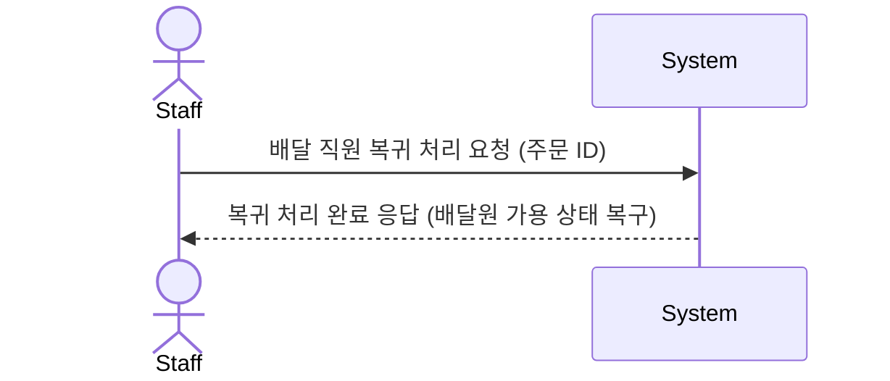

### 7-4. 스태프 가용 현황 조회

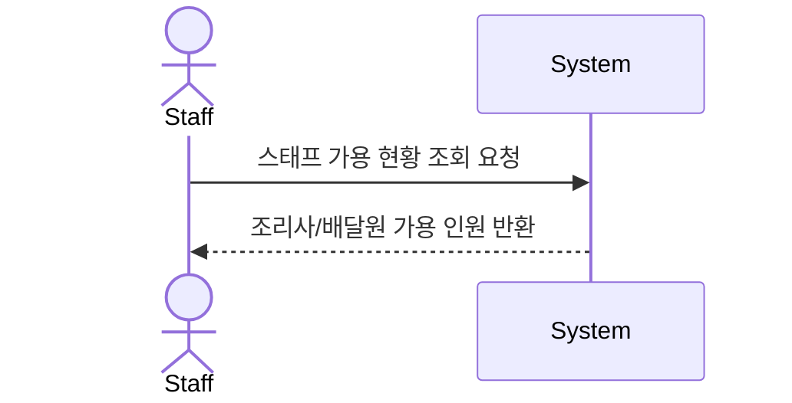
